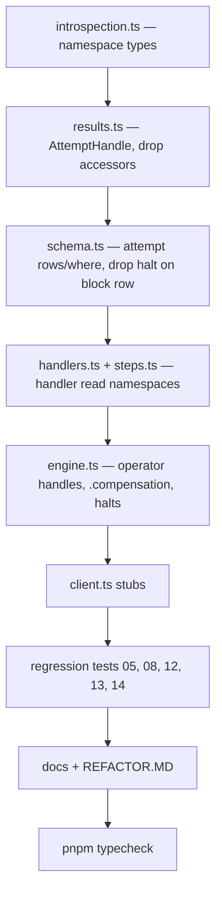

# ## Task 2: Unify request compensation handler to single `(ctx)`
_Exported on 7/3/2026 at 23:17:06 GMT+3 from Cursor (3.9.16)_

---

**User**

## Task 2: Unify request compensation handler to single `(ctx)`

### Context

**Task 0 convention (locked):** Every callback takes **one argument** — a `ctx` object. Domain inputs and engine-provided data live **on** `ctx`, not as extra positional parameters. Primitives keep **their own** ctx shapes (no forced cross-primitive schema). When a definition has no args/payload schema, that key is **omitted** from the type (not `undefined`).

**Task 1 (done):** Request/topic definitions are data-only. Handler registration is **client-only**: `client.requests.<definitionName>.registerHandler(...)`.

**This task:** Change **only** the **request compensation handler** nested under `registerHandler(..., { compensation: { handler, ... } })`.

**Out of scope for this task:**
- Forward request handler — still `(payload, ctx)` until Task 3
- Step `undo`, queue handlers, workflow `execute`, scope, topics
- Runtime implementation (stubs stay stubs)
- Renaming `RequestCompensationInfo` globally or changing step `CompensationInfo`

---

### Goal

Replace:

```typescript
compensation: {
  handler: async (payload, info, ctx) => { ... },
  retryPolicy: { ... },
}
```

With:

```typescript
compensation: {
  handler: async (ctx) => {
    ctx.payload;
    ctx.forward;   // RequestCompensationInfo<TForwardResponse>
    ctx.signal;
    ctx.errors;
  },
  retryPolicy: { ... },
}
```

---

### Target type shape

Extend `RequestCompensationHandlerContext` in `src/types/definitions/handlers.ts`:

```typescript
export interface RequestCompensationHandlerContext<
  TErrors extends ErrorDefinitions = Record<string, never>,
  TPayload = unknown,
  TForwardResponse = unknown,
> extends HandlerContext {
  readonly payload: TPayload;
  readonly forward: RequestCompensationInfo<TForwardResponse>;
  readonly errors: RequestManualEscalationErrorFactories<TErrors>;
}
```

Update `RequestCompensationRegistrationOptions` so `handler` is:

```typescript
readonly handler: (
  ctx: RequestCompensationHandlerContext<
    TCompensationErrors,
    TPayload,
    TForwardResponse
  >,
) => Promise<RequestCompensationHandlerReturn<TCompensation>>;
```

Remove the three-parameter form entirely. Parameter name should be `ctx` (not `opts`).

Keep **`RequestCompensationInfo<TResponse>`** as a standalone type in `src/types/definitions/steps.ts` — it is the type of **`ctx.forward`**. Update its doc comment: forward outcome is read from `ctx.forward`, not a separate `info` argument.

**Field naming (decided):**
- `payload` — original request payload (same name as forward handler will use in Task 3)
- `forward` — forward invocation snapshot (`RequestCompensationInfo`); keep internal union shape (`response` on `completed`, `reason` on `timed_out`, etc.) — do **not** normalize to step `result` naming

---

### Files to change

#### Types

- `src/types/definitions/handlers.ts` — ctx interface + `RequestCompensationRegistrationOptions.handler` signature
- `src/types/definitions/steps.ts` — comment on `RequestCompensationInfo` only (unless exports need adjustment)

Ensure public re-exports through `src/types.ts` / barrel files still export `RequestCompensationHandlerContext` and `RequestCompensationInfo` if they did before.

#### Regression tests

- `src/types-regression-tests/14_requests.ts` — main compensation block (~243+): rewrite handler to `(ctx)`, update type asserts:
  - `ctx.payload` typed as request payload
  - `ctx.forward extends RequestCompensationInfo<...>`
  - `ctx extends RequestCompensationHandlerContext<compensation errors, payload, forward response>`
  - Branch on `ctx.forward.status`, use `ctx.forward.response` when completed
  - Keep `@ts-expect-error` that compensation `ctx.errors` do not take `{ manual }`
- `src/types-regression-tests/08_compensation_model.ts` — both compensation handlers (`compApproval`, `compManualReview`): same migration

Do **not** change forward handler signatures in these files (`async (payload, ctx)` stays).

#### Docs

- `docs/primitives/requests.md` — compensation registration example + “Forward outcome” section: single `(ctx)`, `ctx.payload`, `ctx.forward`, `ctx.errors`, `ctx.signal`. Fix typo `"completed"c` on line ~239 if still present.
- `refactor/08_compensation_model.MD` — update example/signature prose to match (light touch)

Skip broad `REFACTOR.MD` edits unless one line directly references the old 3-arg compensation handler.

---

### Behavior / semantics (unchanged)

Only the **handler invocation shape** changes. These rules stay as documented:

- Compensation `ctx.errors`: `(message)` or `(message, details)` only — no `{ manual }`
- `return` reports compensation outcome; any `throw` → manual
- Retry exhaustion → manual (no `onExhausted`)
- `compensation.retryPolicy` required when `handler` is set
- Non-compensable requests: `compensation?: never` on registration options

---

### Verification

```bash
pnpm typecheck
```

Must pass with zero errors.

Optionally `pnpm lint` on touched files.

---

### Acceptance criteria

1. `RequestCompensationRegistrationOptions.handler` accepts **exactly one** argument: `RequestCompensationHandlerContext<TErrors, TPayload, TForwardResponse>`.
2. Context includes **`payload`**, **`forward`**, **`signal`**, **`errors`** (compensation error map).
3. No remaining `(payload, info, ctx)` or `(payload, info, opts)` compensation handlers in `src/`.
4. Forward request handlers still use `(payload, ctx)` — unchanged.
5. `14_requests.ts` and `08_compensation_model.ts` typecheck with updated asserts.
6. `docs/primitives/requests.md` compensation section matches the new signature.


---

**Cursor**

I'll read the relevant type definitions, regression tests, and docs to migrate the compensation handler to a single `(ctx)` argument.


Implementing the type and test updates.


Cleaning up regression test assertions to match the existing pattern.


Updating the documentation.


Task 2 is done. Request compensation handlers now take a single `ctx` argument.

### Types (`handlers.ts`)

`RequestCompensationHandlerContext` now carries `payload`, `forward`, `errors`, and `signal` (via `HandlerContext`):

```143:152:src/types/definitions/handlers.ts
export interface RequestCompensationHandlerContext<
  TErrors extends ErrorDefinitions = Record<string, never>,
  TPayload = unknown,
  TForwardResponse = unknown,
> extends HandlerContext {
  readonly payload: TPayload;
  readonly forward: RequestCompensationInfo<TForwardResponse>;
  readonly errors: RequestManualEscalationErrorFactories<TErrors>;
}
```

`RequestCompensationRegistrationOptions.handler` is `(ctx) => Promise<...>` only — the three-parameter form is removed.

### `RequestCompensationInfo` (`steps.ts`)

Doc comment updated: forward outcome is read from `ctx.forward`, not a separate `info` argument.

### Regression tests

- `14_requests.ts` — compensation handler uses `(ctx)` with asserts on `ctx.payload`, `ctx.forward`, and full `RequestCompensationHandlerContext<errors, payload, forwardResponse>`
- `08_compensation_model.ts` — both `compApproval` and `compManualReview` handlers migrated; forward handlers still `(payload, ctx)`

### Docs

- `docs/primitives/requests.md` — examples and “Forward outcome” section use single `(ctx)`; fixed `"completed"c` typo
- `refactor/08_compensation_model.MD` — example and prose updated

### Verification

`pnpm typecheck` passes with zero errors. No remaining `(payload, info, ctx)` compensation handlers under `src/`. Forward handlers unchanged.

---

**User**

prepare examples that showcase the new api. I need to check whether the new api follows the intended design.

---

**Cursor**

I'll pull the current compensation handler types and docs so the examples match the new single-`ctx` API exactly.


Examples below mirror the current types and regression tests. Use them to check whether the single-`ctx` shape reads clearly and stays consistent with Task 0.

---

## Context shape (what you get)

```typescript
// Compensation handler — ONE argument
handler: async (ctx) => {
  ctx.payload;   // original request payload (same name as forward will use in Task 3)
  ctx.forward;   // RequestCompensationInfo<TForwardResponse>
  ctx.signal;    // AbortSignal (per attempt)
  ctx.errors;    // compensation block error map — no { manual }
}

// Forward handler — still TWO arguments (Task 3)
handler: async (payload, ctx) => {
  ctx.signal;
  ctx.errors;    // forward error map — { manual } required
}
```

Design check: compensation gets **everything on one object**; forward still splits domain input (`payload`) from engine context (`ctx`). That matches “primitives keep their own ctx shapes” while aligning on **`payload`** as the domain field name.

---

## Example 1 — Happy path (typed result + errors)

Definition + registration together — the most common case:

```typescript
const reserveFlightTicket = defineRequest({
  name: "reserveFlightTicket",
  payload: z.object({ customerId: z.string(), flightDate: z.string() }),
  response: z.object({ reservationId: z.string(), ticketId: z.string() }),
  compensation: {
    result: z.object({ released: z.boolean() }),
    errors: { ReleaseBlocked: true },
  },
});

client.requests.reserveFlightTicket.registerHandler(
  async (payload, ctx) => {
    return await reserveTicket(payload, { signal: ctx.signal });
  },
  {
    retryPolicy: { timeoutSeconds: 30, maxAttempts: 3 },
    compensation: {
      handler: async (ctx) => {
        // Domain input lives on ctx — same field name forward will use
        const { customerId, flightDate } = ctx.payload;

        if (ctx.forward.status !== "completed") {
          throw ctx.errors.ReleaseBlocked(
            `No reservation to release for ${customerId} on ${flightDate}`,
          );
        }

        await releaseReservation(ctx.forward.response.reservationId, {
          signal: ctx.signal,
        });

        return { released: true }; // typed by compensation.result schema
      },
      retryPolicy: { timeoutSeconds: 30, maxAttempts: 3 },
    },
  },
);
```

**Design signals:**
- `ctx.payload` + `ctx.forward.response` — clear split between “what we asked for” vs “what forward produced”
- `ctx.forward.status !== "completed"` narrows before touching `ctx.forward.response`
- Business success → `return`; operator-needed failure → `throw ctx.errors.X(...)`

---

## Example 2 — `compensation: true` (void return)

No result schema; handler returns nothing:

```typescript
const sendNotification = defineRequest({
  name: "sendNotification",
  payload: z.object({ userId: z.string(), template: z.string() }),
  response: z.object({ messageId: z.string() }),
  compensation: true,
});

client.requests.sendNotification.registerHandler(
  async (payload, ctx) => ({ messageId: await send(payload, { signal: ctx.signal }) }),
  {
    compensation: {
      handler: async (ctx) => {
        if (ctx.forward.status === "completed") {
          await revokeMessage(ctx.forward.response.messageId, { signal: ctx.signal });
        }
        // void — block completes with no typed result; operator skip() takes no arg
      },
      retryPolicy: { timeoutSeconds: 15 },
    },
  },
);
```

**Design check:** `return` with no value vs `return { ... }` — the handler signature stays `(ctx) => Promise<void | TResult>` depending on definition, not on call-site overloads.

---

## Example 3 — All three `ctx.forward` branches

Shows the discriminated union and attempt inspection:

```typescript
compensation: {
  handler: async (ctx) => {
    switch (ctx.forward.status) {
      case "completed": {
        // ctx.forward.response is in scope here
        const { reservationId, ticketId } = ctx.forward.response;
        await cancelBoth(reservationId, ticketId, { signal: ctx.signal });
        return { released: true };
      }

      case "timed_out": {
        // ctx.forward.reason: "attempts_exhausted" | "deadline"
        // NO ctx.forward.response — type system rejects it
        const failedAttempts = await ctx.forward.attempts.all();
        if (failedAttempts.length === 0) {
          // forward never ran — maybe still safe to no-op
          return { released: false };
        }
        throw ctx.errors.ReleaseBlocked(
          `Forward timed out (${ctx.forward.reason}); manual cleanup needed`,
        );
      }

      case "terminated": {
        const last = await ctx.forward.attempts.last();
        // workflow/work was cancelled mid-flight — decide from attempt history
        throw ctx.errors.ReleaseBlocked(
          `Forward terminated after attempt ${last?.attemptNumber ?? "unknown"}`,
        );
      }
    }
  },
  retryPolicy: { timeoutSeconds: 30 },
},
```

**Design check:** `forward` keeps request-specific naming (`response` on completed, not step-style `result`). That’s intentional asymmetry vs step `CompensationInfo.result`.

---

## Example 4 — Separate error maps (forward vs compensation)

Forward and compensation declare **different** error codes:

```typescript
const approvalRequest = defineRequest({
  name: "approvalRequest",
  payload: z.object({ documentId: z.string(), tenantId: z.string() }),
  response: z.object({ approved: z.boolean(), reviewerId: z.string() }),
  errors: {
    NeedsHumanReview: true,
    RulesEngineRejected: z.object({ ruleId: z.string() }),
  },
  compensation: {
    result: z.object({ cancelled: z.boolean() }),
    errors: {
      ReleaseBlocked: true,
      ProviderUnavailable: z.object({ provider: z.string() }),
    },
  },
});

client.requests.approvalRequest.registerHandler(
  async (payload, ctx) => {
    if (payload.documentId === "manual") {
      throw ctx.errors.NeedsHumanReview("Needs senior reviewer", { manual: true });
    }
    return { approved: true, reviewerId: "r-1" };
  },
  {
    compensation: {
      handler: async (ctx) => {
        // ctx.errors = compensation map only (ReleaseBlocked, ProviderUnavailable)
        // NOT NeedsHumanReview / RulesEngineRejected

        if (ctx.forward.status !== "completed") {
          throw ctx.errors.ReleaseBlocked("Nothing to release");
        }

        try {
          await releaseHold(ctx.payload.documentId, { signal: ctx.signal });
        } catch (e) {
          throw ctx.errors.ProviderUnavailable("PSP down", { provider: "stripe" });
          // any throw → manual; no { manual: true } option
        }

        return { cancelled: ctx.forward.response.approved };
      },
      retryPolicy: { timeoutSeconds: 30 },
    },
  },
);
```

**Design check:** One `ctx` object, but **`ctx.errors` meaning depends on which handler you’re in** — same pattern as forward today, without mixing forward disposition into compensation.

---

## Example 5 — Outcome matrix (return vs throw vs retry)

```typescript
compensation: {
  handler: async (ctx) => {
    // SUCCESS — business outcome
    if (ctx.forward.status === "completed" && alreadyReleased(ctx.forward.response)) {
      return { released: true }; // idempotent success
    }

    // MANUAL — operator must decide (declared error)
    if (ctx.forward.status === "terminated") {
      throw ctx.errors.ReleaseBlocked("Cannot auto-release after termination");
    }

    // RETRY — transient failure (unhandled throw)
    try {
      await releaseReservation(ctx.forward.response!.reservationId, {
        signal: ctx.signal,
      });
    } catch {
      throw new Error("network blip"); // retry per compensation.retryPolicy
    }

    return { released: true };
    // retry exhaustion → manual automatically (no onExhausted hook)
  },
  retryPolicy: { timeoutSeconds: 30, maxAttempts: 5 },
},
```

---

## Example 6 — Side-by-side: forward (old) vs compensation (new)

Same request, two handler shapes on one registration:

```typescript
client.requests.chargeCard.registerHandler(
  // Forward — Task 3 will unify this to (ctx) too
  async (payload, ctx) => {
    return charge(payload.amount, payload.cardId, { signal: ctx.signal });
  },

  {
    retryPolicy: { maxAttempts: 3, timeoutSeconds: 10 },
    compensation: {
      // Compensation — Task 2 (now)
      handler: async (ctx) => {
        const { amount, cardId } = ctx.payload;

        if (ctx.forward.status !== "completed") return;

        await refund(ctx.forward.response.chargeId, amount, { signal: ctx.signal });
      },
      retryPolicy: { timeoutSeconds: 30 },
    },
  },
);
```

**Design tension to evaluate:** After Task 3, forward becomes `async (ctx) => { ctx.payload; ... }` and both handlers look identical in shape. Compensation still has **`ctx.forward`** and a different **`ctx.errors`** map — that’s the real discriminator, not arity.

---

## Type-level expectations (from regression tests)

If inference is working, inside the compensation handler you should see:

```typescript
handler: async (ctx) => {
  // ctx.payload: { documentId: string; tenantId: string }
  // ctx.forward: RequestCompensationInfo<{ approved: boolean; reviewerId: string }>
  // ctx extends RequestCompensationHandlerContext<
  //   InferRequestCompensationErrors<typeof approvalRequest>,
  //   Payload,
  //   ForwardResponse
  // >

  ctx.forward.status === "completed"
    ? ctx.forward.response.approved   // OK
    : ctx.forward.response;           // @ts-error — no response on non-completed

  ctx.errors.ReleaseBlocked("msg");                    // OK
  ctx.errors.ReleaseBlocked("msg", { manual: true }); // @ts-error — no manual
};
```

---

## Design checklist

| Question | Intended answer |
|----------|-----------------|
| Single argument everywhere? | Compensation: yes. Forward: still `(payload, ctx)` until Task 3. |
| Domain input on ctx? | `ctx.payload` — same name forward will adopt. |
| Forward snapshot name? | `ctx.forward`, not `info` / `result`. |
| Completed forward data? | `ctx.forward.response` (not normalized to `result`). |
| Engine/runtime on ctx? | `ctx.signal`, `ctx.errors`. |
| Compensation errors vs forward? | Separate maps; compensation has no `{ manual }`. |
| Success vs manual? | `return` vs `throw` (any throw → manual for compensation). |
| Non-compensable request? | `compensation?: never` on registration options. |

---

## Possible friction points (worth a deliberate read)

1. **`ctx.forward.response` vs step `info.result`** — same concept, different names. Consistent within requests, but different from step `undo(ctx, args, info)`.
2. **Forward still `(payload, ctx)`** — temporary asymmetry until Task 3; compensation-first readers may wonder why registration mixes styles.
3. **`throw` always manual for compensation** — no `{ manual: false }` retry path like forward; examples 4–5 make that explicit.
4. **`timed_out` / `terminated` with no response** — handlers must use `ctx.forward.attempts`; easy to forget if docs only show the happy path.

If you want these as a runnable scratch file in the repo (e.g. `examples/request-compensation-api.ts` with `@ts-expect-error` annotations), say the word and I can add it.

---

**User**

Ok, have a look at my reasoning behind the compensation flow. What are we currently doing wrong? Are we missing any of the api?

---


This example has an incorrectly written compensation block:

```typescript
client.requests.reserveFlightTicket.registerHandler(
  async ({ payload, signal }) => {
    return await reserveTicket(payload, { signal });
  },
  {
    compensation: {
      handler: async ({ payload, forward, signal, errors }) => {
        const { customerId, flightDate } = payload;
        if (forward.status !== "completed") {
          return {
            compensated: false,
            comment: `No reservation to release for ${customerId} on ${flightDate}`,
          };
        }
        await releaseReservation(ctx.forward.response.reservationId, {
          signal,
        });
        return { released: true };
      },
    },
  },
);
```

The problem is that we assume that a forward effect only took place if the handler has not thrown an error. However, a mutation may have happened, even though we'd never got a successsful return. The simplest example would be:

```typescript
client.requests.reserveFlightTicket.registerHandler(
  async ({ payload, signal }) => {
    const response = await reserveTicket(payload, { signal });
    return parseResponse(response);
  },
);
```

Where `parseResponse` isn't IO bound, but still throws. And when it throws, as it's currently written, the engine will schedule a retry, considering the exception to be a flake.

It's one thing that `reserveTicket` should be idempotent. The other thing is that the `compensation.handler` should not consider the forward block to be atomic. A `"completed"` status with a returned result could help compensate in a straightforward way:

```typescript
client.requests.reserveFlightTicket.registerHandler(
  async ({ payload, signal }) => {
    const response = await reserveTicket(payload, { signal });
    return parseResponse(response);
  },
  {
    compensation: {
      handler: async ({ payload, forward, signal, errors }) => {
        let reservedTicket = forward.response;
        const { customerId, flightDate } = payload;
        if (forward.status !== "completed") {
          reservedTicket = await lookForReservedTicket(payload, signal);
          if (!reservedTicket) {
            // the remote service says that there is no reservation that matches our initial request
            // this is good, as this means that we weren't able to reserve it after all,
            // so no compensation is needed
            return {
              compensated: false,
              reason: "ticket not found, compensation not needed"
            };
          }
          // if reserved ticket was found, we actually need to proceed
        }
        const { released, reason } = await releaseReservation(reservedTicket.reservationId, {
          signal,
        });
        if (!released) {
          // we have to wait for an operator to manually handle this case, otherwise we'd break the compensation flow
          throw errors.ReservationReleaseFailed(`Reservation release failed: ${reason || "reason unknown"}`, {
            ticket: reservedTicket,
            reason: reason
          }, { manual: true });
        }
        return { compensated: true };
      },
    },
  },
);
```

You see how every path either:

- automatically resolves the compensation
- or ends with a manual intervention


---

**Cursor**

I'll compare your compensation-flow reasoning against the current types, docs, and the compensation-retry-awareness rule.


Your reasoning matches what `REFACTOR.MD` and `docs/primitives/steps.md` already say about step `undo`. The gap is mostly **guidance and examples**, not the core `(ctx)` shape from Task 2. A few API asymmetries matter for the `parseResponse` case.

---

## What you're getting right

1. **Forward settlement ≠ remote mutation.** `"completed"` means the handler returned and the engine persisted a response. `"timed_out"` / `"terminated"` mean the engine never got that — not “nothing happened remotely.”

2. **Compensation must not treat non-`completed` as “no-op”.** Returning `{ compensated: false, comment: "..." }` without checking external state is unsafe when a POST may have landed.

3. **Reconciliation is the correct pattern.** On non-`completed`, probe (`lookForReservedTicket`), then either:
   - **`return`** — auto-complete (“nothing to undo” / “undo succeeded”)
   - **`throw ctx.errors.X(...)`** — park for operator

4. **The `parseResponse` case is real** — and it splits into two problems:
   - **Forward:** unhandled throw → retry (flake semantics)
   - **Compensation:** must not assume atomic forward block

That matches REFACTOR’s “ghost side effects” section and the step doc’s “POST that may have landed” paragraph.

---

## What we're currently doing wrong

### 1. Docs and examples teach the anti-pattern

`docs/primitives/requests.md` still reads like: “if not `completed`, bail.”

```typescript
if (ctx.forward.status !== "completed") {
  throw ctx.errors.ReleaseBlocked("Forward did not complete — nothing to release");
}
```

That contradicts your rule and what `steps.md` already documents for `undo`. Request compensation has **no equivalent** of the step section *“Deciding what to undo: `info.status` and `info.attempts`”*.

Your `compensation-retry-awareness.mdc` rule captures the right model, but its “bad” example is what we still show users in `requests.md`. The regression test in `14_requests.ts` also throws on non-`completed` without reconciliation — fine for typing, bad as a behavioral exemplar.

### 2. Step vs request attempt semantics are asymmetric (and under-documented for compensation)

From the type comment on `RequestCompensationInfo`:

> `attempts` lists handler tries … **(failed tries only for request handlers)**

Steps persist **every** execution attempt (including successes). Request handlers persist **failures only**.

So for:

```typescript
const response = await reserveTicket(payload, { signal });
return parseResponse(response); // throws
```

`ctx.forward.attempts` tells you *that* attempts failed (and with what error), but **not** that `reserveTicket` returned `{ reservationId }` on a given try. Your `lookForReservedTicket` fallback is the right workaround — the API does not surface partial in-handler success.

### 3. Your “correct” example uses API we deliberately removed

```typescript
throw errors.ReservationReleaseFailed(..., { manual: true });
```

Compensation `ctx.errors` takes `(message)` or `(message, details)` only — **any throw of a declared error → manual**. Semantically you want manual; syntactically `{ manual: true }` is wrong and rejected (see `14_requests.ts` `@ts-expect-error`).

Use:

```typescript
throw ctx.errors.ReservationReleaseFailed(
  `Reservation release failed: ${reason ?? "reason unknown"}`,
  { ticket: reservedTicket, reason },
);
```

### 4. Forward handler retry semantics aren't documented for post-I/O failures

The `parseResponse` problem is primarily a **forward-handler authoring** issue:

| Failure kind | Current behavior |
|---|---|
| Unhandled throw (e.g. `parseResponse`) | Failed attempt → **retry** per `retryPolicy` |
| `throw ctx.errors.X(..., { manual: false })` | Failed attempt → **retry** |
| `throw ctx.errors.X(..., { manual: true })` | **Manual** — no retry |

There is no third disposition like “mutation may have happened, don’t retry blindly.” Authors must structure forward code (idempotency keys, split phases, throw `manual: true` when side effect is known). That guidance exists implicitly for steps; not for request forward handlers.

---

## Is any API actually missing?

Task 2’s surface is **sufficient for your intended flow**, if written against `ctx`:

| Need | Available today? |
|---|---|
| Original payload | `ctx.payload` |
| Forward settlement snapshot | `ctx.forward` (`RequestCompensationInfo`) |
| Failed forward attempt history | `ctx.forward.attempts` (failures only) |
| Abort per compensation try | `ctx.signal` |
| Auto-complete compensation | `return { ... }` (typed by `compensation.result`) |
| Operator intervention | `throw ctx.errors.X(...)` |
| Transient compensation failure | unhandled `throw` → retry → exhaustion → manual |

What’s **not** on the compensation handler (by design today):

- **`{ manual }` on compensation errors** — removed; all declared throws escalate
- **Partial forward response when status ≠ `"completed"`** — no `ctx.forward.response` on those branches (correct narrowing)
- **Engine evidence that external IO succeeded before in-handler throw** — not captured; reconciliation must be external (`lookForReservedTicket`, idempotency keys, etc.)
- **Declared compensation dependencies** (like step `undo`’s `ctx.requests` / `ctx.steps`) — request compensation is a **client callback**, not a compensation-workflow body; reconciliation is direct SDK/API calls

Possible **future** API (not required for your mental model, but would reduce footguns):

1. **Forward-side “commit boundary”** — explicit signal that external mutation happened so the engine stops retrying that attempt as a flake
2. **Richer request attempt records** — e.g. persist external correlation id / partial outcome when handler fails after IO
3. **Request compensation docs parity with `steps.md`** — same “attempts vs I/O” section, applied to `ctx.forward`
4. **Eager compensation promotion on call-time timeout** — REFACTOR describes this for compensable forwards; runtime is still stubbed, not reflected in types/examples

---

## Corrected version of your “good” example (current API)

```typescript
client.requests.reserveFlightTicket.registerHandler(
  async (payload, ctx) => {
    const response = await reserveTicket(payload, { signal: ctx.signal });
    return parseResponse(response);
  },
  {
    retryPolicy: { timeoutSeconds: 30, maxAttempts: 3 },
    compensation: {
      retryPolicy: { timeoutSeconds: 30, maxAttempts: 3 },
      handler: async (ctx) => {
        const { customerId, flightDate } = ctx.payload;

        let reservation = ctx.forward.status === "completed"
          ? ctx.forward.response
          : await lookForReservedTicket(ctx.payload, ctx.signal);

        if (!reservation) {
          return {
            compensated: false,
            reason: "ticket not found, compensation not needed",
          };
        }

        const { released, reason } = await releaseReservation(
          reservation.reservationId,
          { signal: ctx.signal },
        );

        if (!released) {
          throw ctx.errors.ReservationReleaseFailed(
            `Reservation release failed: ${reason ?? "reason unknown"}`,
            { ticket: reservation, reason },
          );
        }

        return { compensated: true };
      },
    },
  },
);
```

Notes:
- Forward still `(payload, ctx)` until Task 3
- `compensation.result` must declare `{ compensated, reason? }` (or your chosen shape)
- `ReservationReleaseFailed` belongs on **`compensation.errors`**, not forward `errors`

---

## Bottom line

| Layer | Status |
|---|---|
| Your compensation **reasoning** | Aligned with REFACTOR + step docs |
| Task 2 **`(ctx)` API** | Enough for reconcile → return vs throw |
| What we’re doing **wrong** | Teaching “non-`completed` ⇒ no-op” in request docs/examples; not explaining request `attempts` limits; no post-I/O forward-handler guidance |
| What’s **missing from API** | Not the ctx fields — mostly **documentation**, **authoring patterns**, and optionally **forward-side commit/partial-outcome** tooling for the `parseResponse` class of bugs |

The highest-impact fix is probably porting the step doc’s “attempts vs I/O” section into `requests.md` and replacing the compensation examples (including the one in `compensation-retry-awareness.mdc`, which also has a stray `ctx.forward` after destructuring). I can draft that doc section or align the regression examples to the reconciliation pattern if you want.

---

**User**

> Steps persist every execution attempt (including successes). Request handlers persist failures only.

They don't. Any step can have exactly a single successful attempt. What are you talking about? requests share the same semantics too: if you've successfully completed a request, the last attempt will be successful.

> ctx.forward.attempts tells you that attempts failed (and with what error), but not that reserveTicket returned { reservationId } on a given try.

It really shouldn't. Once we've had a successful attempt and written the result, we have the result returned. Attempts are either failed or successful, but again, an attempt that never wrote its result is considered an attempt nonetheless - it's not failed per se, but not successful either, since we've never written the result: so in such a case it's gonna end up in an "attempt limbo" where it's neither successful, nor failed, but nonetheless done: it can happen, if, say, a worker was shut down unexpectedly, so graceful interruption was never triggered. this still counts as an attempt, though.

> Your “correct” example uses API we deliberately removed

You're correct here. And it was a mistake that we've removed it. There could still be transient errors. We could still want transient errors to be strongly typed. We have to get `{ manual: boolean }` back into the compensation flow.

---

**Cursor**

You're right to push back — I'll re-read how attempts are modeled for steps and requests before revising the analysis.


You're right on all three points. I was leaning on imprecise comments in the repo (`failed tries only`, steps persisting “every try”) instead of the model you're actually designing toward. Here is a corrected read.

---

## 1. Attempt semantics — corrected

**Your model:** Steps and requests share the same lifecycle:

- Retries produce **failed** attempts (or limbo — see below).
- **At most one successful completion** per forward invocation. When forward settles as `"completed"`, the engine has persisted the response — that's `ctx.forward.response`. You don't need attempt history to recover `{ reservationId }` in that case.
- Attempt history is for **everything that happened before that**, and for **non-`completed`** forward outcomes.

So my claim that “steps keep all successes in the log but requests don't, so compensation can't see partial success” was wrong in the way that matters for your example:

| Forward outcome | What compensation has |
|---|---|
| `"completed"` | `ctx.forward.response` — full typed result |
| `"timed_out"` / `"terminated"` | No response; `ctx.forward.attempts` + external reconciliation |

The `parseResponse` case is **not** “we lost the reservation id in attempt records.” It's:

- Forward never reached `"completed"` (handler threw before return was persisted).
- Remote mutation **may** still have happened.
- Compensation must **not** infer “nothing to undo” from status alone — hence `lookForReservedTicket`.

That's exactly your reasoning. I incorrectly routed through a steps-vs-requests asymmetry that isn't the real story.

---

## 2. Attempt limbo — this is the subtle case I underplayed

You're describing a third attempt shape:

- Worker started an attempt.
- Never wrote a result (crash, SIGKILL, no graceful shutdown).
- **Not** a captured failure (no throw persisted).
- **Not** a success (no result row).
- Still counts as an attempt for “was forward tried?” purposes.

REFACTOR Part 15 hints at this — nullable error fields, “abruptly terminated attempt has no error info” — but the **public type story doesn't name limbo explicitly**. `Attempt` is still modeled as `Failure extends ...` with `failedAt`, which reads like “every row is a failure” even when the intended semantics are “started but never settled.”

For compensation design, limbo matters because:

- `ctx.forward.status !== "completed"` does **not** mean “safe to no-op.”
- Limbo attempts mean “we tried, we don't know how it ended” — same reconciliation posture as a thrown `parseResponse`, sometimes **worse** (no error message to classify as pre-reach vs post-reach).

**Gap in current API/docs:** no first-class **attempt outcome** discriminant (`failed` | `succeeded` | `unsettled`) on attempt rows, and no doc section saying compensation must treat limbo like ambiguous post-reach.

---

## 3. `{ manual: boolean }` on compensation — you're right that removing it was a mistake

Task 2 locked in “any compensation `throw ctx.errors.X(...)` → manual,” mirroring workflow/step undo (“throw halts / no disposition flag”). That collapses two paths your good example needs:

```typescript
// Transient — should retry under compensation.retryPolicy
throw ctx.errors.ProviderTimeout("PSP unreachable", { manual: false });

// Operator — park the block
throw ctx.errors.ReservationReleaseFailed("Release rejected by airline", details, {
  manual: true,
});
```

Forward handlers already have this split via `RequestErrorDisposition`. Compensation should mirror it:

| Disposition | Forward handler | Compensation handler (intended) |
|---|---|---|
| `return result` | Resolve invocation | Complete compensation block |
| `throw ctx.errors.X(..., { manual: false })` | Failed attempt → retry | Failed attempt → retry |
| `throw ctx.errors.X(..., { manual: true })` | → `manual` | → `manual` |
| Unhandled throw | Failed attempt → retry | Failed attempt → retry |
| Retry exhaustion | → `manual` | → `manual` |

Removing `{ manual }` forces a false choice:

- Model transient failures as **undeclared throws** (loses typed `code` + `details` on the attempt row), or
- Model them as **declared throws** (immediate manual — wrong for `ProviderTimeout`).

Your `releaseReservation` example needs **both** typed errors **and** disposition — same as forward.

**What needs to change (types + docs, not just prose):**

1. Compensation `ctx.errors` factories take `{ manual }` again (same shape as forward, or a shared disposition type).
2. `RequestManualEscalationErrorFactories` name/surface becomes misleading — it's really `RequestErrorFactories`-shaped with required disposition.
3. Regression tests: restore `{ manual: false }` / `{ manual: true }` asserts; remove the `@ts-expect-error` that `{ manual }` is forbidden on compensation.
4. Outcome table in `requests.md` / `error-model.md`: declared error + `manual: false` → retry, not “moves to manual.”

Unhandled throws can stay retry-by-default; declared errors get explicit control.

---

## Revised picture of what's actually wrong today

| Issue | Status |
|---|---|
| Docs teach “non-`completed` ⇒ bail without reconciliation” | Still wrong vs your model |
| Compensation lacks `{ manual }` | **Design bug** (per you), not intentional simplification |
| Attempt limbo unnamed in types/docs | **Missing conceptual API** |
| Steps vs requests attempt asymmetry in comments | **Misleading** in repo; your unified model is the target |
| Missing partial forward response on non-`completed` | **Not a gap** — reconciliation is by design; `response` only on `"completed"` is correct |
| Forward `parseResponse` retry behavior | Forward-handler concern; fixable with `{ manual: true }` when side effect is known, idempotency, or structure — separate from compensation ctx shape |

---

## Your good example, aligned with intended API

```typescript
compensation: {
  handler: async (ctx) => {
    let reservation =
      ctx.forward.status === "completed"
        ? ctx.forward.response
        : await lookForReservedTicket(ctx.payload, ctx.signal);

    if (!reservation) {
      return { compensated: false, reason: "ticket not found, compensation not needed" };
    }

    const { released, reason } = await releaseReservation(
      reservation.reservationId,
      { signal: ctx.signal },
    );

    if (!released) {
      throw ctx.errors.ReservationReleaseFailed(
        `Reservation release failed: ${reason ?? "reason unknown"}`,
        { ticket: reservation, reason },
        { manual: true },
      );
    }

    return { compensated: true };
  },
},
```

And elsewhere in the same handler, transient failures:

```typescript
throw ctx.errors.ProviderTimeout("PSP unreachable", { manual: false });
```

Every path: **`return`** (auto-done) | **`throw` + `manual: false`** (typed retry) | **`throw` + `manual: true`** (operator) | exhaustion → manual.

---

## Summary

Your compensation flow reasoning is sound. My earlier analysis was wrong where it invented a steps/requests attempt split and over-weighted “attempts can't tell you the reservation id.” The real gaps are:

1. **Documentation** still teaches the anti-pattern.
2. **`{ manual }` on compensation errors** should come back (you're correct that removing it was a mistake).
3. **Attempt limbo** should be named and folded into the same “don't treat non-`completed` as no-op” guidance as thrown post-IO failures.

If you want to move on this, the natural next step is a small type task: restore `{ manual }` on compensation `ctx.errors`, update `14_requests.ts` / `error-model.md` / `requests.md`, and fix the misleading “failed tries only” comments to match your unified attempt model. I can implement that when you're ready.

---

**User**

ok. before we move on, I'd like you to solidify the compensation understanding as a rule for the future. this pattern has been repeated for a long time by many writers before you, and it's a big deal that we now centralize the knowledge about the attempts, retries and compensation strategy. I just drafted compensation-retry-awareness.mdc just as an example. I don't think we'd wanna have an example-heavy rule, since the actual public api might be subject to change. What do you think?

---

**Cursor**

I'll review your draft rule and how other project rules are structured so the recommendation fits your conventions.


You're right to avoid an example-heavy rule. Examples go stale fast — especially while handler arity, error disposition, and field names are still moving. The draft `.mdc` already shows that: mixed signatures (`ctx.forward` vs destructuring), `{ manual: true }` on compensation (removed in types today, coming back per your direction), and domain-specific names baked into `alwaysApply` context.

## Recommendation: principles in the rule, examples in docs

**Split responsibilities:**

| Layer | Role | Stability |
|---|---|---|
| **`.cursor/rules/compensation-retry-awareness.mdc`** | Invariants, decision rules, anti-patterns (no API literals) | High — survives API refactors |
| **`docs/primitives/steps.md` / `requests.md`** | Current signatures, worked examples, outcome tables | Medium — updated when API changes |
| **`refactor/` or ADR** | Narrative, historical “why”, long scenarios | Low churn, not loaded every session |

The rule should teach *how to think*, not *how to spell the call site*. When an agent needs syntax, it reads the primitive docs (same pattern as `writing-docs.mdc` — meta-rule for docs, not a duplicate of them).

## What belongs in the rule (API-agnostic)

These are the bits writers keep getting wrong, and they won't change when you unify forward to `(ctx)` or restore `{ manual }`:

1. **Forward settlement ≠ remote mutation.** Engine `"completed"` means a result was persisted, not “nothing happened externally.” `"timed_out"` / `"terminated"` mean no successful return was recorded — not “no side effect.”

2. **Compensation must not treat forward as atomic.** Never infer “nothing to undo” from non-`completed` forward status alone. Reconcile with external/domain truth when forward didn't settle cleanly.

3. **Attempt model (three outcomes).** An attempt is failed (captured error), succeeded (result written — at most one per forward invocation), or **unsettled/limbo** (started, no result written — crash, hard kill). Limbo counts as “we tried”; same reconciliation posture as ambiguous failure.

4. **Compensation exit strategy.** Every path must land in one of:
   - **Auto-complete** — return a compensation outcome (including explicit “nothing to undo”).
   - **Retry** — transient failure (declared error with retry disposition, or unhandled throw per policy).
   - **Manual** — operator must decide (declared error with manual disposition, or retry exhaustion).

5. **Forward vs compensation responsibilities.**
   - **Forward:** idempotency, post-I/O failure awareness, correct retry vs manual disposition when side effects may have happened.
   - **Compensation:** assume partial/unknown forward effects; probe when needed; never early-return “no-op” on status alone.

6. **Anti-patterns (name them, don't code them).**
   - “If forward ≠ completed → return no-op comment.”
   - “Only read forward response when completed” *without* a reconciliation branch for other statuses.
   - “All declared compensation errors immediately manual” (wrong once `{ manual }` returns).
   - Docs/examples that imply attempt history replaces external reconciliation.

7. **Pointer, not duplicate.** One line: for current handler shapes and registration API, read `docs/primitives/steps.md` (step `undo`) and `docs/primitives/requests.md` (request compensation).

## Scope: prefer globs over `alwaysApply: true`

Your draft uses `alwaysApply: true`, which loads ~90 lines of stale API into every conversation (including unrelated fixes).

Better:

```yaml
---
description: Compensation, attempt, and retry invariants — apply when writing or reviewing undo/compensation handlers, attempt semantics, or related docs/tests
globs: docs/**/*.md,src/types-regression-tests/**/*.ts,src/types/definitions/**/*.ts,refactor/**/*.MD
alwaysApply: false
---
```

That hits the places where the anti-pattern actually appears. If you want a *minimal* always-on reminder (3–5 lines), pair it with the full rule as requestable — but one focused rule is usually enough with a good `description`.

## Shape: ~40 lines, decision table, no code blocks

Something like:

```markdown
# Compensation and retry awareness

## Invariants
- … (bullets above)

## When forward did not complete
1. Do not assume no remote mutation.
2. Use attempt history for reachability/ambiguity hints.
3. Reconcile with external/domain state when outcome is unknown.
4. Then: return (auto-done) | retry | manual.

## Outcome disposition (conceptual)
| Intent              | Mechanism                                      |
| Auto-complete       | Return compensation result                     |
| Transient failure   | Declared error, retry disposition (or unhandled throw) |
| Operator required   | Declared error, manual disposition             |
| Exhaustion          | Engine → manual                                |

## Anti-patterns
- …

## Canonical API reference
See docs/primitives/steps.md and docs/primitives/requests.md for current signatures.
```

No TypeScript blocks — or at most one *pseudocode* line (“reconcile → release → return or escalate”), not real API.

## Tension with the create-rule skill

The skill says “concrete examples” and “under 50 lines.” For *this* domain I'd override that: **principles over examples** because the failure mode is repeated wrong *reasoning*, not wrong syntax. The skill's example-heavy guidance fits lint/style rules; compensation is architectural.

## What I'd avoid

- **`alwaysApply: true` + long examples** — highest staleness cost.
- **Duplicating `steps.md`** — you already have good attempt-vs-I/O prose there; the rule should align with it and point to it, not fork it.
- **API literals in the rule** — `ctx.forward`, `{ manual }`, `(payload, ctx)` will all churn in the next tasks.

---

**Bottom line:** Yes — a compact, invariant-first rule is the right move. Keep the draft's *reasoning* (non-atomic forward, reconciliation, three exit paths), strip the code, add the attempt-limbo point and the disposition table, scope with globs, and treat primitive docs as the living API reference.

If you want, I can rewrite `compensation-retry-awareness.mdc` into that form in one pass.

---

**User**

let's not use globs, they don't work well. let's also wonder whether it wouldn't be better to `alwaysApply: true`. I wonder whether this rule shouldn't explain the compensation strategy overall. It seems like this knowledge would almost always be applicable to any work on the project. what do you think?

---

**Cursor**

You're right to drop globs if they aren't reliable in your setup — a rule that only loads sometimes is worse than none for something this cross-cutting.

## On `alwaysApply: true`

For **this** repo, I'd lean **yes**, with one condition: the rule stays **short and API-free**.

Natalia isn't a generic app where compensation is a niche corner. Compensation, attempts, and retry disposition sit under almost everything you touch — types, docs, regression tests, refactor notes, handler examples. The recurring failure isn't "forgot a field name"; it's "wrote compensation as if forward were atomic." That's exactly the kind of mistake you want in every agent's head before it edits *anything* that might mention handlers, undo, or request lifecycle.

The cost of `alwaysApply` is token budget and noise. Your other always-on rules are one-liners (`typecheck`, `import-syntax`). A 90-line example block would be too heavy. A **~45–55 line invariant doc** is comparable to loading one extra always-on convention — acceptable if it prevents a class of wrong docs and examples.

When **not** to always-apply: if the rule grows into a mini-REFACTOR (scheduling, DB rows, eager FIFO, operator handles). That belongs in docs/refactor; the rule should only carry what changes *authoring behavior*.

## Should it explain compensation strategy overall?

**Yes — at the mental-model level**, not the implementation level.

Split it into three layers:

| Layer | Where | Content |
|---|---|---|
| **Always-on rule** | `.mdc` | *Why* compensation exists, forward vs compensation roles, settlement vs mutation, attempt outcomes, three exit paths, anti-patterns |
| **Primitive docs** | `steps.md`, `requests.md` | Current API, examples, outcome tables |
| **REFACTOR / runtime** | `refactor/`, `REFACTOR.MD` | Scheduling, persistence, promotion modes |

The rule answers: *"When I write or review anything in this project, what must I never get wrong about compensation?"*  
It should **not** answer: *"How does the base compensation workflow promote instances?"*

That's "strategy overall" in the sense that matters for writers — not full architecture.

## What "overall" should include (compact)

1. **Purpose** — Forward work can leave remote side effects even when the engine never recorded success; compensation exists to reconcile/undo that. (One sentence; no REFACTOR citation needed.)

2. **Two compensation surfaces** — Step `undo` (compensation-workflow body, declared deps) vs request compensation handler (client callback). Same *invariants*, different registration — don't conflate them in examples, but don't duplicate opposite advice either.

3. **Forward settlement ≠ remote truth** — The core invariant everyone keeps violating.

4. **Attempt outcomes** — Failed / succeeded (result written) / unsettled (limbo). Shared across steps and requests.

5. **Author split** — Forward: idempotency + correct retry vs manual when post-I/O ambiguity is known. Compensation: never no-op on status alone; reconcile externally when forward didn't complete cleanly.

6. **Exit taxonomy** — Auto-complete (return) | retry (transient) | manual (operator or exhaustion). Applies to both forward handlers and compensation once `{ manual }` is restored on compensation errors.

7. **Anti-patterns** — Named, no code.

8. **Single pointer** — "Current signatures and examples: `docs/primitives/steps.md`, `docs/primitives/requests.md`."

## What to leave out of always-on

- Handler arity (`(ctx)` vs `(payload, ctx)`)
- Field names (`forward` vs `info`)
- Long scenarios (`parseResponse`, `lookForReservedTicket`) — those belong in docs as the canonical narrative
- Step vs request attempt-storage implementation details (the misleading "failed tries only" comments in the repo should be fixed in types/docs, not canonized in the rule)

## Recommendation

- **`alwaysApply: true`** — yes, for this project, if you rewrite the draft into ~50 lines of invariants.
- **No globs** — agreed.
- **Strategy overall** — yes, but as **authoring invariants**, not architecture spec.
- **No examples** — agree with your instinct; one optional pseudocode flow ("reconcile → act → return | retry | manual") at most.

If you want, I can replace `compensation-retry-awareness.mdc` with that shape next — compact, always-on, example-free, covering the full mental model without binding to today's API.

---

**User**

let's go ahead and write this rule

---

**Cursor**

I'll rewrite the rule as a compact, always-on mental model aligned with our discussion and the existing step docs.


Replaced the draft with a compact always-on rule at `.cursor/rules/compensation-retry-awareness.mdc` (~65 lines, no code examples).

It covers:

- **Why compensation exists** — ghost side effects, non-atomic forward
- **Two surfaces** — step `undo` vs request compensation handler (same invariants)
- **Settlement vs remote truth** — the core invariant writers keep violating
- **Attempt outcomes** — failed / succeeded / unsettled limbo
- **Forward vs compensation author duties**
- **Exit path table** — auto-complete, retry, manual
- **Anti-patterns** — named, no API literals
- **Pointer** — `docs/primitives/steps.md` and `requests.md` for current API

`alwaysApply: true`, no globs. Field names and handler arity stay out so Task 3 and restoring `{ manual }` on compensation won't stale the rule.

If you want it shorter (closer to 45 lines), we can trim the author-responsibilities section or merge the anti-patterns into bullets under settlement vs remote truth.

---

**User**

We should conclude the rule with a single phrase. The cornerstone idea of this engine is that the compensation hook runs if there was at least a single attempt: it doesn't matter if the attempt ever reached an IO point or not - the power could've been shut down right mid payload deserialization -  it's none of the engine's concern - rather it's a dev's responsibility to ensure that they are aware of this fact when writing the forward (retry idempotency) and compensation (remote state awareness and idempotency, again) passes

---

**Cursor**

Added this as the closing line:

**One attempt is enough:** compensation runs whenever forward had at least one try — whether that try reached I/O, failed during payload parsing, or ended in limbo is not the engine's concern; the author owns idempotent forward retries and idempotent compensation grounded in remote-state awareness.

---

**User**

ok. now, again, once we've set the principles in stone, let's reiterate what we want done about the public api.

---

**Cursor**

I'll check the current compensation types and docs against the principles we locked in, then summarize the public API work still needed.


Here is the public API backlog, grounded in the rule and our thread. **Done** vs **still to do** are separated so you can sequence tasks.

---

## Done (Task 2)

Request compensation handler registration:

- **Single argument:** `(ctx: RequestCompensationHandlerContext<TErrors, TPayload, TForwardResponse>)`
- **`ctx` fields:** `payload`, `forward` (`RequestCompensationInfo`), `signal`, `errors`
- **No** `(payload, info, ctx)` form
- Types + regression tests in `14_requests.ts` / `08_compensation_model.ts` updated
- Basic docs updated to `(ctx)` and `ctx.forward`

Forward handler is **unchanged:** still `(payload, ctx)`.

---

## Next: align API with the principles (highest priority)

### 1. Restore `{ manual: boolean }` on compensation `ctx.errors`

Task 2 removed it (`RequestManualEscalationErrorFactories` — any declared throw → manual). The rule and your intent say compensation needs the **same disposition model as forward**:

| Call | Effect |
|---|---|
| `return result` | Compensation block completes |
| `throw ctx.errors.X(..., { manual: false })` | Failed attempt → retry per `compensation.retryPolicy` |
| `throw ctx.errors.X(..., { manual: true })` | Block → `manual` |
| Unhandled throw | Retry per policy |
| Retry exhaustion | → `manual` |

**Type work:**

- Compensation `ctx.errors` uses `RequestErrorFactories` (or shared disposition type), not `RequestManualEscalationErrorFactories`
- Update `RequestCompensationHandlerContext` doc comment
- Fix `14_requests.ts`: remove `@ts-expect-error` on `{ manual }`; add asserts for both dispositions
- Fix `docs/primitives/requests.md`, `docs/error-model.md`, `REFACTOR.MD` Part 15b compensation bullet

### 2. Fix docs and examples to teach reconciliation, not bail-on-non-completed

`docs/primitives/requests.md` compensation section still shows early throw when forward ≠ `"completed"`. Replace with the pattern from the rule:

- Completed → use persisted forward outcome
- Otherwise → reconcile with remote/domain state → then return (“nothing to undo”) or undo or escalate

Port the narrative from `docs/primitives/steps.md` (“Deciding what to undo”) into request compensation — same invariants, request-specific registration.

**Regression tests:** update compensation handler examples in `14_requests.ts` / `08_compensation_model.ts` so they model reconciliation (or at least don’t encode the anti-pattern).

### 3. Fix misleading attempt semantics in types/docs

Comments still say requests persist “failed tries only” while the rule says steps and requests share one lifecycle (failed / succeeded / unsettled). Align:

- `RequestCompensationInfo` comment in `steps.ts`
- `AttemptAccessor` comment in `results.ts`
- `docs/error-model.md` attempt-history section

State clearly: **one successful completion writes the result**; attempt accessor exposes history for ambiguity; **unsettled** attempts are a real case.

---

## Task 3 (planned, separate): unify forward handler to `(ctx)`

Same Task 0 convention as compensation:

```typescript
handler: async (ctx) => {
  ctx.payload;
  ctx.signal;
  ctx.errors; // still requires { manual }
}
```

Remove `(payload, ctx)`. Out of scope until explicitly scheduled; forward and compensation will then share arity and `payload` naming.

---

## Explicitly out of scope (for now)

| Item | Why |
|---|---|
| Runtime implementation | Stubs stay stubs |
| Step `undo` signature change | Separate surface; step undo keeps `(ctx, args, info)` until its own task |
| Renaming `RequestCompensationInfo` / step `CompensationInfo` | Locked names |
| New engine APIs for “commit boundaries” or partial forward capture | Author responsibility per rule; reconcile externally |
| Attempt row discriminant (`failed` \| `succeeded` \| `unsettled`) in public types | Desirable later; not blocking doc/type disposition fix |

---

## Suggested task order

1. **Restore `{ manual }` on compensation errors** (types + tests + docs) — unblocks correct transient vs operator paths  
2. **Rewrite request compensation docs + examples** — reconciliation pattern, outcome table matches forward  
3. **Fix attempt-semantics comments** — stop contradicting the rule  
4. **Task 3** — forward handler `(ctx)`  
5. *(Optional)* Step compensation docs pass — ensure `steps.md` and `requests.md` don’t diverge on invariants  

---

## Acceptance criteria (public API)

1. Compensation handler: `(ctx)` only; `ctx.payload`, `ctx.forward`, `ctx.signal`, `ctx.errors`
2. Compensation `ctx.errors`: `(message, { manual })` or `(message, details, { manual })` — same as forward
3. No docs/examples that no-op compensation from forward status alone without reconciliation
4. Attempt semantics documented consistently for steps and requests
5. Forward handler still `(payload, ctx)` until Task 3
6. `pnpm typecheck` clean after each task

---

**Cornerstone (unchanged):** one forward attempt ⇒ compensation may run; IO reachability is the author’s problem on both passes.

If you want to proceed, the natural next implementation task is **#1 — restore `{ manual }` on compensation errors**.

---

**User**

let's go ahead with the implementation.

---

**Cursor**

Implementing compensation `{ manual }` restoration, doc/example updates, and attempt-semantics fixes. Exploring all touchpoints first.


Updating regression tests and documentation.


Implementation complete. Summary of changes:

### Types
- **`RequestCompensationHandlerContext.errors`** now uses `RequestErrorFactories` (same `{ manual }` disposition as forward handlers).
- Removed **`RequestManualEscalationErrorFactories`**.
- Updated comments on `RequestErrorFactories`, `AttemptAccessor`, and `RequestCompensationInfo`.

### Regression tests
- **`14_requests.ts`** — compensation handler tests `{ manual: false }` / `{ manual: true }`, requires `{ manual }`, non-completed path escalates to manual (no status-only no-op).
- **`08_compensation_model.ts`** — reconciliation-style return on non-completed `compApproval`; `NeedsOperator` uses `{ manual: true }`.
- **`05_attempt_accessor.ts`** — comment aligned with unified attempt model.

### Docs
- **`docs/primitives/requests.md`** — reconciliation examples, updated outcome table with `{ manual }` on compensation errors.
- **`docs/error-model.md`** — forward and compensation share error disposition; unified attempt lifecycle.
- **`refactor/08_compensation_model.MD`**, **`refactor/14_requests.MD`**, **`REFACTOR.MD`** — aligned prose.

### Schema
- **`RequestCompensationStatus`** `manual` comment updated.

`pnpm typecheck` passes.

**Still out of scope:** Task 3 (forward handler `(ctx)`), runtime stubs, step `undo` signature.

---

**User**

let me once again see code examples of the public api we've developed.

---

**Cursor**

I'll pull the current handler types and docs so the examples match what's implemented.


Current public API for compensable requests — as implemented today.

---

## 1. Definition (data-only)

Forward and compensation declare **separate** error maps:

```typescript
const reserveFlightTicket = defineRequest({
  name: "reserveFlightTicket",
  payload: z.object({ customerId: z.string(), flightDate: z.string() }),
  response: z.object({ reservationId: z.string(), ticketId: z.string() }),
  errors: {
    NeedsInventory: true, // forward handler only
  },
  compensation: {
    result: z.object({ released: z.boolean() }),
    errors: {
      ReleaseBlocked: true,
      ProviderUnavailable: z.object({ provider: z.string() }),
    },
  },
});
```

Shorthand: `compensation: true` — no typed result schema; handler returns `void`.

---

## 2. Registration — forward + compensation together

```typescript
client.requests.reserveFlightTicket.registerHandler(
  // Forward — still (payload, ctx) until Task 3
  async (payload, ctx) => {
    const response = await reserveTicket(payload, { signal: ctx.signal });
    return parseResponse(response);
  },
  {
    retryPolicy: { timeoutSeconds: 30, maxAttempts: 3 },
    maxConcurrent: 5,
    retentionPolicy: async (ctx) =>
      ctx.status === "resolved" ? 86400 : null,

    compensation: {
      // Compensation — single (ctx)
      handler: async (ctx) => {
        // ...
      },
      retryPolicy: { timeoutSeconds: 30, maxAttempts: 3 },
      maxConcurrent: 2,
    },
  },
);
```

When `compensation.handler` is set, `compensation.retryPolicy` is **required**. Non-compensable requests: `compensation?: never`.

---

## 3. Context shapes

```typescript
// Forward handler
async (payload, ctx) => {
  ctx.signal;   // AbortSignal
  ctx.errors;   // forward errors map — { manual } required
}

// Compensation handler
async (ctx) => {
  ctx.payload;  // original request payload
  ctx.forward;  // RequestCompensationInfo<TForwardResponse>
  ctx.signal;   // AbortSignal
  ctx.errors;   // compensation errors map — { manual } required
}
```

Both handlers use the same error factory shape: `RequestErrorFactories` with `{ manual: boolean }`.

---

## 4. `ctx.forward` — discriminated union

```typescript
type RequestCompensationInfo<TResponse> =
  | { status: "completed"; response: TResponse; attempts: AttemptAccessor }
  | {
      status: "timed_out";
      reason: "attempts_exhausted" | "deadline";
      attempts: AttemptAccessor;
    }
  | { status: "terminated"; attempts: AttemptAccessor };
```

```typescript
compensation: {
  handler: async (ctx) => {
    if (ctx.forward.status === "completed") {
      const { reservationId } = ctx.forward.response;
      // ...
    }

    if (ctx.forward.status === "timed_out") {
      const reason = ctx.forward.reason; // "attempts_exhausted" | "deadline"
      const attempts = await ctx.forward.attempts.all();
      // ctx.forward.response — type error
    }

    if (ctx.forward.status === "terminated") {
      await ctx.forward.attempts.last();
      // no response, no reason
    }
  },
},
```

---

## 5. Full compensation handler — reconciliation + disposition

The intended pattern from the rule and docs:

```typescript
compensation: {
  handler: async (ctx) => {
    let reservation =
      ctx.forward.status === "completed"
        ? ctx.forward.response
        : await lookForReservedTicket(ctx.payload, ctx.signal);

    if (!reservation) {
      return { released: false }; // explicit no-op after reconciliation
    }

    try {
      await releaseReservation(reservation.reservationId, {
        signal: ctx.signal,
      });
    } catch {
      throw ctx.errors.ProviderUnavailable("PSP unreachable", {
        provider: "stripe",
      }, { manual: false }); // transient → retry
    }

    const { released, reason } = await tryRelease(reservation.reservationId, {
      signal: ctx.signal,
    });

    if (!released) {
      throw ctx.errors.ReleaseBlocked(
        `Release failed: ${reason ?? "unknown"}`,
        { manual: true }, // operator required
      );
    }

    return { released: true };
  },
  retryPolicy: { timeoutSeconds: 30, maxAttempts: 3 },
},
```

---

## 6. Error disposition — forward and compensation (same model)

```typescript
// Forward
async (payload, ctx) => {
  throw ctx.errors.NeedsInventory("No ticket yet", { manual: true });  // → manual
  throw ctx.errors.RulesRejected("Bad input", { manual: false });     // → retry
  throw new Error("network blip");                                    // → retry
}

// Compensation
async (ctx) => {
  throw ctx.errors.ReleaseBlocked("Blocked", { manual: true });       // → manual
  throw ctx.errors.ProviderUnavailable("PSP down", { provider: "x" }, {
    manual: false,
  });                                                                   // → retry
  throw new Error("network blip");                                    // → retry
}
```

| Action | Outcome |
|---|---|
| `return result` | Block / invocation completes |
| `throw ctx.errors.X(..., { manual: false })` | Failed attempt → retry |
| `throw ctx.errors.X(..., { manual: true })` | → `manual` |
| Unhandled throw | Failed attempt → retry |
| Retry exhaustion | → `manual` |

Business outcomes (`released: false`, `compensated: false`) belong in **`return`**, not errors.

---

## 7. Forward handler — post-I/O awareness

Forward still owns idempotency and retry vs manual when side effects may have happened:

```typescript
async (payload, ctx) => {
  const response = await reserveTicket(payload, { signal: ctx.signal });
  // parseResponse throws → engine retries (unless you throw manual: true)
  return parseResponse(response);
}
```

---

## 8. Operator actions on compensation blocks

```typescript
const found = await workflowHandle.compensations.requests.reserveFlightTicket.findUnique(
  ({ payload }) => eq(payload.customerId, "cust-1"),
);

if (found.status === "unique") {
  await found.value.skip({ released: true });
  await found.value.escalateToManual({
    code: "ReleaseBlocked",
    message: "Operator must release manually",
  });
}
```

---

## 9. Side-by-side summary

```typescript
client.requests.approvalRequest.registerHandler(
  async (payload, ctx) => {
    // TWO args — Task 3 will unify
    payload.documentId;
    ctx.signal;
    ctx.errors.NeedsHumanReview("...", { manual: true });
    return { approved: true, reviewerId: "r-1" };
  },
  {
    retryPolicy: { maxAttempts: 3, timeoutSeconds: 30 },
    compensation: {
      handler: async (ctx) => {
        // ONE arg
        ctx.payload.documentId;
        ctx.forward.status;          // "completed" | "timed_out" | "terminated"
        ctx.forward.response;        // only when status === "completed"
        ctx.signal;
        ctx.errors.ReleaseBlocked("...", { manual: true });
        return { cancelled: true };
      },
      retryPolicy: { timeoutSeconds: 30 },
    },
  },
);
```

---

**Cornerstone (from the rule):** one forward attempt ⇒ compensation may run. Whether that attempt reached I/O is the author's problem on both passes — reconcile on compensation, idempotize on forward.

---

**User**

now we have to make sure we didn't mess up the client search with the refactors. what is it looking like at the moment?

---

**Cursor**

I'll trace how client search is wired for requests and compensation and compare it to the refactored types.


Client search was **not touched** by the compensation refactors. Those changes were limited to handler context types, error factories, docs, and regression tests around `registerHandler` compensation. The search surface lives in `engine.ts`, `introspection.ts`, `schema.ts` (row/where templates), `search-query.ts`, and `client.ts` — all unchanged. `pnpm typecheck` still passes, including `14_requests.ts` (request search) and `14_client_search_extend.ts` (workflow search).

---

## Client shape today

```typescript
const client = createWorkflowClient({ myWorkflow, otherWorkflow });

client.workflows.<workflowRegistryKey>   // start, execute, get, findUnique, findMany, count
client.requests.<requestDefinitionName> // get, findUnique, findMany, count, registerHandler
client.queues.<queueDefinitionName>     // registerHandler, deadLetters.{get, findUnique, findMany, count}
```

Three top-level namespaces. Workflows are keyed by **registry key**; requests and queues by **definition `name`** (deduped across all workflows in the client map).

---

## Unified search API (`QueryableNamespace`)

Every searchable namespace shares the same surface:

| Method | Role |
|---|---|
| `.get(id)` | Sync handle construction (no I/O); optional `fields` prefetch |
| `.findUnique(query, opts?)` | Predicate → `FindUniqueResult<Handle>` (`unique` \| `missing` \| `ambiguous`) |
| `.findMany(query, opts?)` | Predicate → `FindManyResult<Handle>` — **awaitable array** and **async iterable** |
| `.count(query, opts?)` | Same predicate, aggregate count |

Predicates use `natalia/search` combinators against a row-shaped scope:

```typescript
import { and, eq } from "./search";

const requestMany = client.requests.approvalRequestAcceptance.findMany(
  ({ status, payload }) =>
    and(eq(status, "manual"), eq(payload.documentId, "doc-1")),
  {
    fields: { id: true, payload: true },
    sort: [{ path: "priority", direction: "desc" }],
    limit: 1,
  },
);

const requests = await requestMany;           // materialize all
for await (const h of requestMany) { /* … */ } // or stream

const found = await client.requests.approvalRequestAcceptance.findUnique(
  ({ payload }) => eq(payload.documentId, "doc-1"),
);

const count = await client.requests.approvalRequestAcceptance.count((scope) =>
  eq(scope.status, "manual"),
);
```

---

## Request search — typed against `RequestRow`

Predicate scope is `RequestWhereTemplate` = full `RequestRow`:

```typescript
interface RequestRow<TRequestName, TPayload, TResponse> {
  id: RequestId<TRequestName>;      // branded by definition name
  requestName: TRequestName;
  status: "pending" | "claimed" | "resolved" | "manual" | "timedOut";
  priority: number;
  payload: TPayload;
  response: TResponse | null;
  createdAt: Date;
  claimedAt: Date | null;
  resolvedAt: Date | null;
  manualAt: Date | null;
  timedOutAt: Date | null;
  deadlineAt: Date | null;
}
```

Type-level checks in `14_requests.ts`:

- `client.requests.approvalRequestAcceptance` resolves to `RequestNamespaceExternal<name, payload, response, …, forwardErrors, compensationDef, compensationErrors>`
- Workflow-local slot `client.requests.approval` is **rejected** — only definition `name` keys the client namespace
- `payload.documentId` in predicates is typed; unknown fields are errors
- `get("plain-id")` rejected — ids are branded

Handles returned from search expose operator actions (separate from query):

```typescript
await request.resolve({ approved: true, reviewerId: "manual-reviewer" });
await request.escalateToManual({
  code: "NeedsHumanReview",
  message: "Escalated while reviewing queue",
});
await requestHandle.fetchRow({ payload: true, status: true });
```

`RequestManualEscalationInput` (for `escalateToManual`) is **unchanged** — only the removed `RequestManualEscalationErrorFactories` (compensation handler `ctx.errors`) was deleted.

---

## What the refactors did **not** break

| Area | Status |
|---|---|
| `QueryableNamespace` shape | Unchanged |
| `RequestNamespaceExternal` search + `registerHandler` | Unchanged; compensation options still nest under registration |
| Search predicates / sort / `fields` prefetch | Unchanged |
| Branded `RequestId<definitionName>` | Unchanged |
| Workflow client search (`14_client_search_extend.ts`) | Unchanged |
| Workflow-handle compensation search (`workflowHandle.compensations.requests.<slot>`) | Unchanged — lives on **handle**, not client |

Compensation **instance** search is on the **workflow handle**, keyed by workflow-local request **slot**:

```typescript
await workflowHandle.compensations.requests.approvalRequest.findUnique(
  ({ payload }) => eq(payload.customerId, "cust-1"),
);
```

That is intentionally separate from `client.requests.<definitionName>` (forward invocations).

---

## Runtime status

`client.ts` still stubs search methods — they call `assertClientAvailable()` then `throw new Error("Not implemented")`. Typing is the contract; runtime wiring is future work. `registerHandler` returns a no-op `Unsubscribe` stub.

---

## Test coverage map

| File | What it verifies |
|---|---|
| `14_client_search_extend.ts` | Workflow + attached-child search, predicates, sort, `@ts-expect-error` on bad paths |
| `14_requests.ts` | Request namespace typing, `findMany`/`findUnique`/`count`, handle ops, `@ts-expect-error` on bad ids/payloads |
| `12_introspection.ts` | Generic `QueryableNamespace`, workflow-handle compensation search |
| `13_queues.ts` | Dead-letter search |

Request client search is **only** exercised in `14_requests.ts`, not in `14_client_search_extend.ts`.

---

## Bottom line

Client search is intact relative to the compensation work. The public API is still: unified `get` / `findUnique` / `findMany` / `count` on typed row templates, with request namespaces keyed by definition name and compensation handler registration coexisting on the same namespace object without affecting query types.

If you want extra confidence, the next step would be a dedicated `14_client_search_extend`-style file for **request** predicates (sort paths, `status` enum exhaustiveness, cross-field `and`/`or`) — but nothing in the refactors indicates regression there today.

---

**User**

no problem with the runtime, we want to make sure that we have the types correct. my question is about how do we implement the request compensation search currently from client side.

---

**Cursor**

I'll trace the type definitions for request compensation search and confirm whether it's exposed on the client or only on workflow handles.


The direct answer: **request compensation search is not on the client.** There is no `client.compensations` or compensation methods under `client.requests`.

Compensation instances are scoped to a **parent workflow instance** and searched through the **workflow handle**.

---

## Two different search surfaces

| What | Where | Keyed by |
|---|---|---|
| **Forward request invocations** | `client.requests.<definitionName>` | Request definition `name` |
| **Request compensation instances** | `workflowHandle.compensations.requests.<workflowSlot>` | Workflow-local request **slot** |

Example from the regression tests — same request, two keys:

```typescript
// Workflow declares:
requests: { approvalRequest: defineRequest({ name: "introspectionApprovalRequest", ... }) }

// Client forward search (global, cross-workflow):
client.requests.introspectionApprovalRequest.findMany(...)

// Compensation search (per workflow instance):
workflowHandle.compensations.requests.approvalRequest.findUnique(...)
//                                      ^^^^^^^^^^^^^ workflow slot, not definition name
```

Our refactors did not change this split.

---

## How to search compensation (typed flow)

**1. Get a workflow handle** (you need a parent instance first):

```typescript
const client = createWorkflowClient({ orderWorkflow });

// One of:
const handle = await client.workflows.orderWorkflow.start({ args: { orderId: "o-1" } });
const handle = client.workflows.orderWorkflow.get("idem-key");
const handle = await client.workflows.orderWorkflow.execute({ args: { orderId: "o-1" } });

// Or find a running workflow, then use its handle:
const found = await client.workflows.orderWorkflow.findUnique(
  (row) => eq(row.status, "running"),
);
if (found.status === "unique") {
  const handle = found.value;
}
```

**2. Navigate to the compensable request slot** (only compensable requests appear):

```typescript
// Typed namespace — only keys with compensation: true | { result?, errors? }
handle.compensations.requests.approvalRequest
// Non-compensable slots are absent at compile time:
// handle.compensations.requests.pingRequest  // @ts-expect-error
```

**3. Use the unified query surface** (`QueryableNamespace`):

```typescript
import { and, eq } from "./search";

// By id
const byId = handle.compensations.requests.approvalRequest.get(compInstanceId);

// With row prefetch
const withRow = handle.compensations.requests.approvalRequest.get(compInstanceId, {
  id: true,
  payload: true,
  status: true,
});

// Predicate search
const found = await handle.compensations.requests.approvalRequest.findUnique(
  ({ payload, status }) =>
    and(eq(status, "manual"), eq(payload.chargeId, "ch-1")),
);

const many = handle.compensations.requests.approvalRequest.findMany(
  ({ status }) => eq(status, "running"),
  {
    fields: { id: true, status: true },
    sort: [{ path: "createdAt", direction: "desc" }],
    limit: 50,
  },
);

const count = await handle.compensations.requests.approvalRequest.count(
  ({ status }) => eq(status, "manual"),
);
```

**4. Operate on handles** (not part of search, but what you do after):

```typescript
if (found.status === "unique") {
  const comp = found.value;

  await comp.fetchRow({ payload: true, result: true });
  await comp.attempts();
  await comp.skip({ cancelled: true });
  await comp.escalateToManual({
    code: "ReleaseBlocked",
    message: "Operator must finish release",
  });
}
```

---

## Predicate scope: `RequestCompensationRow`

Search predicates are typed against the compensation row, not the forward row:

```typescript
interface RequestCompensationRow<TPayload, TCompResult> {
  id: RequestCompensationInstanceId;
  requestName: string;   // definition name stored on row
  status: RequestCompensationStatus;  // pending | running | manual | completed | skipped | ...
  payload: TPayload;     // original forward payload
  result: TCompResult | null;
  createdAt: Date;
  startedAt: Date | null;
  completedAt: Date | null;
  manualAt: Date | null;
  skippedAt: Date | null;
}
```

So you can filter on `payload`, `status`, timestamps, etc. — same predicate combinators as everywhere else.

---

## Type wiring (`engine.ts`)

```typescript
// Client — NO compensation tree
interface WorkflowClient<TWfs> {
  workflows: { ... };
  requests: WorkflowClientRequestNamespaces<TWfs>;  // forward only
  queues: { ... };
}

// Workflow handle — compensation tree
interface WorkflowHandleExternal<W> {
  compensations: {
    steps:   /* compensable step slots → CompensationBlockNamespaceExternal */;
    requests: /* compensable request slots → RequestCompensationNamespaceExternal */;
  };
  // ...
}
```

`RequestCompensationNamespaceExternal` is a full `QueryableNamespace` over `RequestCompensationUniqueHandleExternal`, with `get` taking `RequestCompensationInstanceId` (not `RequestId`).

---

## Mental model

- **`client.requests`** — global operator/admin search over **forward** invocations (any workflow that called that request definition).
- **`handle.compensations.requests`** — scoped search over **compensation blocks** for one workflow instance, one request slot at a time.

There is currently **no typed global client search** for compensation instances across all workflows. To implement that at runtime you'd either iterate workflow handles or add a future top-level namespace — it does not exist in the type system today.

If you want, we can sketch what a global `client.requestCompensations` namespace would look like — but that's not part of the current public API.

---

**User**

how is it done with the steps currently? can you look this up? I have a feeling that there already was a compensation search in the steps.

---

**Cursor**

Your instinct is right — **step compensation search exists**, and it’s the **same pattern** as request compensation. Both live on the **workflow handle**, not on `createWorkflowClient`.

---

## Step compensation search today

**Entry point:** `workflowHandle.compensations.steps.<workflowStepSlot>`

Keyed by the **workflow-local step slot** (same as `ctx.steps.chargeStep` in the body), not the step definition’s global `name`. Only **compensable** steps appear — non-compensable slots are absent at compile time.

```typescript
// From 12_introspection.ts — workflow declares:
steps: { chargeStep, noResultCompensableStep, notifyStep }

workflowHandle.compensations.steps.chargeStep           // ✓ compensable
workflowHandle.compensations.steps.noResultCompensableStep  // ✓ compensable
workflowHandle.compensations.steps.notifyStep         // @ts-expect-error — not compensable
```

**Namespace type:** `CompensationBlockNamespaceExternal<TStep, TArgs, TResult>` — a full `QueryableNamespace`:

| Method | Id type |
|---|---|
| `.get(id)` | `CompensationId<TStep>` |
| `.findUnique(query, opts?)` | predicates on `CompensationBlockRow` |
| `.findMany(query, opts?)` | awaitable + async-iterable |
| `.count(query, opts?)` | aggregate |

**Predicate scope** (`CompensationBlockWhereTemplate` = `CompensationBlockRow`):

```typescript
interface CompensationBlockRow<TStep, TArgs, TResult> {
  id: CompensationId<TStep>;
  definitionName: string;
  status: CompensationBlockStatus;  // pending | running | completed | halted | skipped | ...
  args: TArgs;                      // original forward step args
  result: TResult | null;
  info: CompensationInfo<unknown> | null;  // forward outcome snapshot
  halt: HaltRecord | null;
  createdAt, startedAt, completedAt, haltedAt, skippedAt: Date | null;
}
```

**Example** (from regression tests + REFACTOR.MD):

```typescript
import { and, eq } from "./search";

// By branded id
const block = workflowHandle.compensations.steps.chargeStep.get(chargeCompensationId);
const blockWithRow = workflowHandle.compensations.steps.chargeStep.get(
  chargeCompensationId,
  { id: true, args: true },
);

// Predicate search
const found = await workflowHandle.compensations.steps.chargeStep.findUnique(
  ({ args }) => eq(args.customerId, "cust-1"),
);

const many = workflowHandle.compensations.steps.chargeStep.findMany(
  ({ status }) => eq(status, "halted"),
  { fields: { id: true, status: true }, sort: [{ path: "createdAt", direction: "desc" }] },
);

// Operator actions on the handle
if (found.status === "unique") {
  await found.value.fetchRow({ id: true, result: true });
  await found.value.skip({ status: "refunded" });  // typed by compensation.result schema
}
```

Step handles are **richer** than request compensation handles: they also expose `CompensationBlockOperatorActions`, per-instance primitives (`attributes`, `streams`, etc.), and `halt` on the row.

---

## Side-by-side: steps vs requests compensation search

Both are under `workflowHandle.compensations`:

```typescript
workflowHandle.compensations: {
  steps: {
    chargeStep: CompensationBlockNamespaceExternal<"chargeStep", TArgs, TResult>;
    // ...
  };
  requests: {
    approvalRequest: RequestCompensationNamespaceExternal<TPayload, TCompResult, TCompErrors>;
    // ...
  };
};
```

| | Step compensation | Request compensation |
|---|---|---|
| Path | `.compensations.steps.<stepSlot>` | `.compensations.requests.<requestSlot>` |
| Row | `CompensationBlockRow` (`args`, `info`, `halt`, …) | `RequestCompensationRow` (`payload`, simpler) |
| Id | `CompensationId<TStep>` | `RequestCompensationInstanceId` |
| Handle ops | `skip(result)`, halt/primitives | `skip(result?)`, `attempts()`, `escalateToManual()` |
| Search API | Same `QueryableNamespace` | Same `QueryableNamespace` |

`12_introspection.ts` exercises **both** in parallel (`_exerciseChargeCompensationNamespace` and `_exerciseRequestCompensationNamespace`).

---

## What is **not** there

- **No client-level compensation search** for steps or requests — `WorkflowClient` only has `workflows`, `requests` (forward), and `queues`.
- **No global step namespace** like `client.steps` for compensation instances.
- **Legacy flat namespaces removed** — e.g. `workflowHandle.requestCompensations` is rejected; compensation is only under the `compensations.{steps,requests}` tree.

---

## How you get the handle

Same as for request compensation — you need a **workflow instance handle** first:

```typescript
const handle = await client.workflows.orderWorkflow.start({ args: { orderId: "o-1" } });
// or .get(...) / .execute(...) / find from client.workflows.*.findMany

handle.compensations.steps.bookHotel.findMany(...);
handle.compensations.requests.approvalRequest.findUnique(...);
```

---

**Summary:** Step compensation search was already designed and typed — parent-scoped on the workflow handle, unified query surface, keyed by workflow slot. Request compensation search mirrors it under `compensations.requests`. Neither is on the client; forward request search (`client.requests.<definitionName>`) is a separate, global surface for forward invocations only.

---

**User**

ok. can we pull something like this off for the requests as well? are there any blockers you see before we start implementing the query api for the requests compensations?

---

**Cursor**

I'll compare how forward request search is built on the client with request compensation's workflow-handle model and check the types/schema for blockers.


Clarifying first: **request compensation search already mirrors step compensation at the type level.** What you don’t have yet is a **client-global** surface like `client.requests.<definitionName>` for forward invocations.

---

## What already exists (types done)

Step and request compensation share the same pattern on the **workflow handle**:

```typescript
workflowHandle.compensations.steps.chargeStep.findUnique(...)
workflowHandle.compensations.requests.approvalRequest.findUnique(...)
```

Both are `QueryableNamespace` with `get` / `findUnique` / `findMany` / `count`, field prefetch, and `txOrConn`. Exercised in `12_introspection.ts` for both.

So if the goal is **“query API like steps”** — **no new shape is needed**. Remaining work is runtime wiring + maybe richer regression tests, not inventing the API.

---

## What does *not* exist: client-global compensation search

Forward requests have a **global** operator surface:

```typescript
client.requests.introspectionApprovalRequest.findMany(...)  // definition name
```

Request compensation is **only parent-scoped**:

```typescript
workflowHandle.compensations.requests.approvalRequest.findMany(...)  // workflow slot
```

There is no `client.compensations`, no `client.requests.<name>.compensations`, and `WorkflowClient` only declares `workflows | requests | queues`.

If you want **“pull something like `client.requests` for compensations too”**, that’s a **new namespace design**, not filling a gap in the step parity work.

---

## Blockers before implementing (by target)

### A. Wire up workflow-handle query (parity with steps) — low blockers

| Item | Status |
|---|---|
| `RequestCompensationNamespaceExternal` | Done |
| `RequestCompensationRow` where template | Done |
| Handle ops (`skip`, `escalateToManual`, `attempts`, `fetchRow`) | Typed |
| Regression tests | Partial (`12_introspection`; no predicate/sort torture test like `14_client_search_extend`) |
| Runtime in `client.ts` / engine | Stubs only (`Not implemented`) |

**Minor type gaps (fixable, not architectural):**

- DB has `info JSONB`; public `RequestCompensationRow` omits `info` (step rows include `info` + `halt`).
- No `parentWorkflowId` on the row — fine for parent-scoped queries (engine scopes by parent handle), but limits cross-workflow predicates if you ever go global.

**Verdict:** Safe to implement runtime for `handle.compensations.requests.<slot>` following the step compensation path.

---

### B. Add client-global compensation search — design decisions first

**1. Parent-scoped vs global is intentional in REFACTOR**

Step compensation: parent-scoped only (storage = workflow rows).  
Request compensation: parent-scoped (`request_compensation_instance.workflow_id`).  
Forward requests: global (`client.requests`) because invocations are first-class cross-workflow entities.

Global compensation search is **not** in REFACTOR Part 5 / step 12. You’d be extending the design, not completing it.

**2. Keying mismatch (real blocker for ergonomics)**

| Surface | Key |
|---|---|
| `client.requests.*` | Definition **`name`** |
| `handle.compensations.requests.*` | Workflow **`slot`** |

Same request in two workflows → same definition name, different slots. A global namespace almost certainly keys by **definition name** (like forward). Parent-scoped stays on **slot**. Document both or operators get confused.

**3. Id branding**

```typescript
RequestId<TRequestName>              // branded per definition — forward .get(id) is type-safe
RequestCompensationInstanceId        // generic brand only — no __request phantom
```

For `client.requestCompensations.<definitionName>.get(id)` you likely want `RequestCompensationId<TRequestName>` (or similar) so ids don’t mix across definitions — same pattern as forward.

**4. Row template for global predicates**

Current row:

```typescript
interface RequestCompensationRow<TPayload, TCompResult> {
  id, requestName, status, payload, result, timestamps
  // no parentWorkflowId, no info
}
```

For global admin search you’ll probably want at least:

- `parentWorkflowId` or `executionWorkflowId` (filter “compensations for order X”)
- optionally `info` (forward snapshot — matches DB, helps operators)

Without those, global search is only by payload/status/requestName.

**5. Client registry aggregation**

`client.requests` unions all compensable request definitions across registered workflows (deduped by `name`). A global compensation namespace needs the same union over **compensable** requests only, with per-definition payload/result/compensation-error typing — mirrors `WorkflowClientRequestNamespacesFromUnion` but for `RequestCompensationNamespaceExternal`.

**6. Where it lives on the client**

Options:

- `client.requestCompensations.<definitionName>` — parallel top-level (clearest)
- `client.requests.<definitionName>.compensations` — groups forward + compensation under one definition (nice for operators, heavier typing on `RequestNamespaceExternal`)

Pick one before coding; REFACTOR doesn’t prescribe this.

**7. Recent handler refactors**

Compensation `{ manual }` and `(ctx)` handler shape **don’t block** search — search is operator/introspection, separate from handler registration.

---

## Recommendation

| Goal | Feasibility |
|---|---|
| Query compensations **within a workflow** (like steps) | **Yes — types ready; implement runtime + tests** |
| Query compensations **globally from client** (like forward `client.requests`) | **Yes, but needs design pass first** |

Suggested order:

1. **Confirm scope:** workflow-handle only (finish step 12 runtime) vs add global client namespace.
2. If global: decide namespace path, id branding, row fields (`parentWorkflowId`, `info?`).
3. Extend `RequestCompensationRow` + `WorkflowClient` + `client.ts` stubs + regression file (e.g. extend `14_requests` or new `14_client_request_compensation_search.ts`).
4. Wire runtime queries against `request_compensation_instance` filtered by `request_name` (+ `workflow_id` when parent-scoped).

---

**Short answer:** You can already “pull off what steps have” for request compensations on **`workflowHandle.compensations.requests`** — the query API types are there. Blockers mainly appear if you want **`client`-level global search** like forward requests: that’s new surface area (namespace placement, branded ids, richer row template, slot vs definition name story), not a missing mirror of step compensation.

---

**User**

I wonder whether we shouldn't expose instance level compensation access instead of a workflow level one. 

```typescript
const request = await workflowHandle.requests.someRequest.findUnique(...);
request.compensation
```

I think it's more intuitive. What do you think?

---

**Cursor**

Checking whether workflow handles already expose request namespaces and how forward invocations link to compensation rows.


Your instinct matches the data model. Here is how it lines up with what exists today and what would need to change.

---

## Why instance-level access is more intuitive

The DB already links them:

```sql
request_compensation_instance (
  request_id  BIGINT NOT NULL REFERENCES requests(id),  -- the forward invocation
  workflow_id TEXT NOT NULL REFERENCES workflow(id),   -- parent execution workflow
  ...
)
```

So for request compensation there is a natural **1:1** (or 0:1 before registration): one forward invocation → at most one compensation row. The operator question is usually:

> “This request invocation is stuck — what happened with its undo?”

Not:

> “List every `approvalRequest` compensation in this workflow and guess which row matches.”

Workflow-level `compensations.requests.<slot>.findMany(...)` is good for **bulk** (“all manual compensations for this slot”). Instance-level `.compensation` is good for **navigation** from the forward row you already found. Those complement each other; you do not have to drop the namespace.

---

## What exists today

There is **no** `workflowHandle.requests` for forward invocations. On the workflow handle you only have:

```typescript
workflowHandle.compensations.requests.approvalRequest  // compensation instances, keyed by slot
```

Forward search is **global** only:

```typescript
client.requests.introspectionApprovalRequest.findMany(...)
```

So your sketch implies **two** additions, not just moving compensation:

1. A way to get a **forward request handle** in workflow context (or reuse the global one).
2. **`compensation`** on that handle.

---

## Two ways to spell it

**A. From global client (minimal new surface)**

```typescript
const found = await client.requests.approvalRequest.findUnique(
  ({ payload }) => eq(payload.documentId, "doc-1"),
);

if (found.status === "unique") {
  const comp = await found.value.compensation(); // or .compensation when present
  await comp?.skip({ cancelled: true });
}
```

Works because `request_id` is enough to resolve the compensation row — you do not need the workflow handle first. Fits “I searched globally, now drill into undo.”

**B. From workflow-scoped forward search (your sketch)**

```typescript
const found = await workflowHandle.requests.approvalRequest.findUnique(
  ({ payload }) => eq(payload.documentId, "doc-1"),
);

if (found.status === "unique") {
  await found.value.compensation?.escalateToManual({ ... });
}
```

Requires a **new** parent-scoped forward namespace on the workflow handle (like attached children), then `.compensation` on that handle. Fits “I already have this workflow open in the admin UI.”

Both can coexist; they answer different entry points.

---

## Suggested shape for `.compensation`

On `RequestHandleExternal` (for compensable definitions only):

```typescript
interface RequestHandleExternal<..., TCompensation extends ...> {
  // existing: resolve, escalateToManual, fetchRow, id

  // 0 or 1 compensation row for this forward invocation
  compensation(
    opts?: FetchOptions,
  ): Promise<
    FindUniqueResult<
      RequestCompensationUniqueHandleExternal<TPayload, TCompResult, TCompErrors>
    >
  >;
}

// Non-compensable: compensation?: never (or method absent)
```

Use `FindUniqueResult` so “not registered yet” is `missing`, not `null` thrown away silently. Avoid a sync property unless you mandate row prefetch on the parent query.

Optional typed shortcut when parent was fetched with compensation prefetched — same pattern as `HandleWithRow`.

---

## Workflow-level namespace: keep or trim?

| Use case | Best surface |
|---|---|
| “Show me all manual compensations for this slot in this workflow” | `workflowHandle.compensations.requests.<slot>.findMany(...)` |
| “This specific forward invocation — open its compensation” | `requestHandle.compensation()` |
| “Global admin search across workflows” | `client.requests.<name>.findMany` + `.compensation()` |

I would **keep** the workflow-level namespace for bulk/iterable ops and add instance navigation — not replace one with the other.

---

## Steps: same pattern?

Partially. Step compensation is a **child workflow**; linkage is via origin step / registration, not a simple `request_id` FK. Instance-level access still makes sense (“this step dispatch → its compensation block”), but the handle might live on a **step invocation** surface if you add one, not on `RequestHandleExternal`. Request compensation is the easy case to lead with.

---

## Blockers (small, not fundamental)

1. **Type wiring** — add `compensation()` to `RequestHandleExternal` when the definition is compensable; `never` otherwise.
2. **Row linkage** — runtime resolves by `request_id` (and validates `workflow_id` when called from a workflow-scoped handle).
3. **Optional `workflowHandle.requests.<slot>`** — only if you want workflow-scoped forward search; not strictly required if you start from `client.requests`.
4. **Row template** — optional `info` on `RequestCompensationRow` for operator UI (DB already has it).
5. **Id branding** — still worth `RequestCompensationId<TRequestName>` if you add global compensation namespaces later; instance access can hide that.

None of the recent handler refactors (`ctx`, `{ manual }`) block this — it is introspection/operator surface, separate from registration.

---

## Recommendation

Yes — **instance-level `.compensation` on the forward request handle** is the right primary ergonomics for request compensations. It matches the FK, matches operator mental model, and works from both `client.requests` and (if you add it) `workflowHandle.requests`.

Implement in this order:

1. **`RequestHandleExternal.compensation()`** on global client handles (highest value, smallest surface).
2. Keep **`workflowHandle.compensations.requests.<slot>`** for bulk queries.
3. Add **`workflowHandle.requests.<slot>`** later if you want symmetric workflow-scoped forward search.

If you want to proceed, the next concrete task is a type-only change: extend `RequestHandleExternal` + regression tests in `14_requests.ts` / `12_introspection.ts`, without runtime yet.

---

**User**

so we get 3 levels:

```typescript
client.compensations.requests.<request>
workflowHandle.compensations.requests.<request>
workflowHandle.requests.<request>.findUnique(...).compensation
```

Do we get the same idea per step?

```typescript
client.compensations.steps.<step>
workflowHandle.compensations.steps.<step>
workflowHandle.steps.<step>.findUnique(...)compensation
```

When registering the workflows on a client, we can extract their requests and steps just fine and place them on the type. So I think it's not undoable.

---

**Cursor**

I'll check how step invocations are modeled versus requests so we can compare the three-level pattern for both.


Yes — the **three-level ladder** is a coherent model for both, and client registry aggregation is doable the same way as `client.requests` today. There is one important asymmetry between steps and requests at the **forward** layer, and step **level 3** needs a bit more new surface than request level 3.

---

## The three levels (symmetric intent)

| Level | Purpose | Request | Step |
|---|---|---|---|
| **1 — Client global** | Admin search across all workflows | `client.compensations.requests.<defName>` | `client.compensations.steps.<stepName>` |
| **2 — Workflow bulk** | “All compensations for this slot in this run” | `workflowHandle.compensations.requests.<slot>` ✓ today | `workflowHandle.compensations.steps.<slot>` ✓ today |
| **3 — Instance link** | “This forward invocation → its undo” | `…requests.<slot>.findUnique(…).compensation` | `…steps.<slot>.findUnique(…).compensation` |

Levels 1 and 2 are the same *idea* for both. Level 3 is the same *idea*, but the **forward handle** exists for requests and not yet for steps.

---

## Client registry typing — not undoable

You already union request definitions across the workflow map:

```typescript
// Today
client.requests.approvalRequestAcceptance  // keyed by defineRequest.name

// Same pattern
client.compensations.requests.approvalRequestAcceptance
client.compensations.steps.chargeStep    // keyed by defineStep.name, compensable only
```

Walk all workflows → collect compensable definitions → dedupe by definition `name` → build namespaces with correct payload/args/result typing. Same machinery as `WorkflowClientRequestNamespacesFromUnion`, plus a compensable filter.

`WorkflowClient` would grow something like:

```typescript
interface WorkflowClient<TWfs> {
  workflows: …;
  requests: …;           // forward handlers + global forward search (today)
  queues: …;
  compensations: {
    requests: …;         // global compensation instance search
    steps: …;
  };
}
```

That part is straightforward.

---

## Level 2 — already there

Both already exist on the workflow handle under `compensations.{requests,steps}.<slot>`, keyed by **workflow slot** (not definition name). Keep them for bulk ops (`findMany` over all manual blocks in this workflow).

---

## Level 3 — requests (smaller lift)

Forward request operator surface **already exists** globally:

```typescript
client.requests.<defName>.findUnique(...)  → RequestHandleExternal
```

Add to compensable handles:

```typescript
compensation(opts?): Promise<FindUniqueResult<RequestCompensationUniqueHandleExternal<…>>>
```

Linkage: `request_compensation_instance.request_id` → forward row. Works from **client** handles without a workflow handle.

Optional extra (your sketch):

```typescript
workflowHandle.requests.<slot>.findUnique(...)  // parent-scoped forward search — new namespace
```

Same handle type, same `.compensation()`. Useful when the UI is already on one workflow instance.

---

## Level 3 — steps (same idea, more new types)

Step compensation **level 2** exists. Forward step dispatch **does not** have an operator namespace yet — no `workflowHandle.steps`, no `StepDispatchHandle`, no branded forward-step id in the public API.

Storage link is already there:

```text
compensation workflow row.compensation_origin_step_id → step.id (the start_step dispatch)
```

So the symmetric API is absolutely designable:

```typescript
workflowHandle.steps.chargeStep.findUnique(({ args }) => eq(args.customerId, "c-1"))
  → StepDispatchHandle<"chargeStep", TArgs, …>   // new
  → .compensation()
  → CompensationBlockUniqueHandleExternal<"chargeStep", TArgs, TResult>
```

But you are **introducing** the forward step introspection layer, not just hanging `.compensation` on an existing handle.

---

## One structural asymmetry (worth keeping explicit)

| | Requests | Steps |
|---|---|---|
| Forward invocation | Global entity (`requests` table) | Always owned by a workflow (`start_step` row) |
| Global forward search | `client.requests.<defName>` ✓ | No natural `client.steps` — dispatches aren’t global |
| Global compensation search | `client.compensations.requests.<defName>` | `client.compensations.steps.<stepName>` ✓ |

So the **full** 3×2 grid is:

**Requests**

```typescript
client.compensations.requests.<defName>                    // L1
client.requests.<defName>.findUnique(…).compensation()     // L3 (global forward entry)
workflowHandle.compensations.requests.<slot>               // L2
workflowHandle.requests.<slot>.findUnique(…).compensation() // L3 (workflow-scoped forward entry)
```

**Steps**

```typescript
client.compensations.steps.<stepName>                      // L1
workflowHandle.compensations.steps.<slot>                  // L2
workflowHandle.steps.<slot>.findUnique(…).compensation()   // L3 (only forward entry — no client.steps)
```

That asymmetry matches the domain: request handlers are client-global; step executes are workflow-local.

---

## Keying reminder (same at every level)

| Level | Key |
|---|---|
| Client `compensations.*` | Definition **`name`** |
| Workflow `compensations.*` / `requests.*` / `steps.*` | Workflow **slot** |

Document that once; it avoids the slot/name confusion we hit earlier.

---

## Handle shape differences (L3 target types)

```typescript
// Request — lightweight
request.compensation() → RequestCompensationUniqueHandleExternal
  // skip, escalateToManual, attempts

// Step — full compensation block workflow
stepDispatch.compensation() → CompensationBlockUniqueHandleExternal
  // skip, fetchRow, primitives plane, halt on row
```

Same navigation pattern, different handle richness — already true at L2.

---

## Verdict

- **Yes** — the three-level model fits both requests and steps.
- **Yes** — client-side union typing from registered workflows is doable (you’re right).
- **Level 1 + 2 typing** for both: mostly extending `WorkflowClient` and keeping existing `compensations` trees.
- **Request L3**: add `.compensation()` on `RequestHandleExternal`; optionally add `workflowHandle.requests.<slot>`.
- **Step L3**: also add `workflowHandle.steps.<slot>` + forward dispatch handle type, then `.compensation()`.

I would not drop L2 when adding L3 — bulk “all manual chargeStep compensations in this workflow” stays on `compensations.steps.<slot>.findMany`, while “this dispatch’s undo” lives on `.compensation`.

If you want to move forward, a sensible order is: **request L3 on `RequestHandleExternal` first** (smallest diff), then **client.compensations.*** namespaces, then **step dispatch + step L3** as one introspection task.

---

**User**

is `.compensation()` good enough name? Maybe it should be `.getCompensation()` or `fetchCompensation()` what is the current api design suggesting?

---

**Cursor**

I'll scan existing handle methods (`fetchRow`, `get`, `attempts`, etc.) to see what naming and sync/async patterns the API already uses.


The existing API gives a fairly clear answer: **use an async method named after the domain noun**, not `get*` or `fetch*`.

---

## What the codebase already does

| Pattern | Name | Sync? | I/O? | Returns |
|---|---|---|---|---|
| Namespace identity | `.get(id)` | Yes | No | Handle (constructed) |
| Namespace search | `.findUnique` / `.findMany` | — | Yes | Handle(s) |
| **This handle’s row** | `.fetchRow(...)` | — | Yes | `FindUniqueResult<Row>` |
| **Related resource** | `.attempts()` | — | Yes | `FindUniqueResult<AttemptAccessor>` |
| Operator verbs | `.resolve`, `.skip`, `.escalateToManual` | — | Yes | Outcome |

There is **no** `getAttempts`, `fetchAttempts`, `getCompensation`, or `fetchCompensation` anywhere. The one `fetch*` on handles is **`fetchRow`** — specifically “read **my** row again.”

Request compensation handles already use the short noun:

```typescript
attempts(opts?: FetchOptions): Promise<FindUniqueResult<AttemptAccessor>>
```

That is the closest precedent for “from this handle, load a related thing.”

---

## Why not `getCompensation()`?

`.get(...)` in this design means:

- on a **namespace**
- **synchronous**
- you already know the **id**
- **no I/O** — handle is just grounded identity

`getCompensation()` would sound like that but behave differently (async, resolve via `request_id` / `origin_step_id`, cardinality). Easy to confuse with `client.compensations.requests.X.get(id)`.

---

## Why not `fetchCompensation()`?

`fetch*` is reserved for **`fetchRow`** — the handle’s **own** flat row. A compensation handle is a **different entity**, not a projection of the forward row. `fetchCompensation()` suggests “another row fetch on the same handle,” which is what `fetchRow` is for.

---

## Recommendation: `compensation()`

Align with `attempts()`:

```typescript
interface RequestHandleExternal<..., TComp extends ...> {
  compensation(
    opts?: FetchOptions,
  ): Promise<
    FindUniqueResult<
      RequestCompensationUniqueHandleExternal<TPayload, TCompResult, TCompErrors>
    >
  >;
}
```

Same for step dispatch handles → `CompensationBlockUniqueHandleExternal`.

**Why this fits:**

- Async I/O + `FindUniqueResult` matches `attempts()` and `fetchRow` cardinality semantics (`unique` | `missing` | `ambiguous` — usually `missing` before registration).
- Short domain noun matches existing handle methods.
- `opts?: FetchOptions` for `txOrConn` matches Part 19.
- Method, not property — avoids confusion with the **removed** aggregate `handle.compensation.wait()` from old design.

---

## Optional: prefetch, not rename

If you load the parent with a join, the pattern is probably **not** a sync `.compensation` property but extending query prefetch (like `fields` on `findUnique`) to attach a nested handle or snapshot. That would be additive; the on-demand method still wants a name — still `compensation()`.

---

## Summary

| Name | Verdict |
|---|---|
| `.compensation()` | **Best fit** — parallel to `.attempts()` |
| `.getCompensation()` | Conflicts with sync namespace `.get(id)` |
| `.fetchCompensation()` | Conflicts with `.fetchRow()` meaning |
| `.compensation` (property) | Evokes removed workflow-level `compensation` API; implies sync/cached |

So **`compensation()`** is what the current design is suggesting; I would not use `get` or `fetch` prefixes for this navigation.

---

**User**

ok, but isn't `compensation` closer to `.fetchRow` than to `attempts`? let's meditate on that

---

**Cursor**

Good question to sit with. The three methods look similar on the surface (async, on a handle, I/O), but they answer different questions.

---

## What each method is really doing

**`.fetchRow()`** — “What is **this** entity’s persisted row **right now**?”

The handle already *is* the forward request invocation. `fetchRow` re-reads **its own** columns (`status`, `payload`, `response`, …). Same identity, same entity, fresh snapshot.

**`.attempts()`** — “What **retry history** belongs to **this** entity?”

Still anchored on the same entity, but not the primary row. Returns an **`AttemptAccessor`** (collection API: `.all()`, `.count()`, …). Diagnostic/operational log, not a second first-class thing you operate on with its own `skip` / `resolve`.

**`.compensation()`** — “What is the **linked undo entity** for this forward invocation?”

Different primary key, different table (or child workflow for steps), different handle type, different operator verbs (`skip` / `escalateToManual` vs `resolve`). It’s a **peer**, not a column of the forward row and not a subordinate log.

So structurally:

| Method | Target | Relationship to handle |
|---|---|---|
| `fetchRow` | This handle’s row | **Self** |
| `attempts` | Attempt records | **Child collection** on self |
| `compensation` | Compensation handle | **Linked peer entity** |

That’s why it feels ambiguous: compensation is neither “my row” nor “my attempt log.”

---

## Why it can feel like `fetchRow`

From an **operator** perspective, forward + compensation are one story:

> “This request invocation — what happened, and what happened with undo?”

That’s a **paired lifecycle**, almost 1:1. You might think of compensation as “the rest of the row” you didn’t get in the first `fetchRow`. Prefetch could even look row-like:

```typescript
await request.fetchRow({ status: true, payload: true, /* compensationStatus? */ });
```

If the design went that way — compensation **fields embedded on the forward row** or always prefetched as `.row.compensationStatus` — then yes, it’s **`fetchRow` territory** (projection / join on the same handle).

Today it isn’t: compensation is a **separate row** with its own handle and namespace. So the operation is closer to **cross-entity fetch** than to **self row fetch**.

---

## Why it can feel like `attempts`

Both:

- Are async methods on a handle (not namespace `.get(id)`)
- Can return **`FindUniqueResult`** with `missing` when nothing exists yet
- Are optional relative to the forward path

But **`attempts` is not a handle**. You don’t `skip()` an attempt accessor. Compensation returns something you **act on** — a full `RequestCompensationUniqueHandleExternal` with its own `fetchRow`, `skip`, etc.

So `compensation()` is really **navigation to another handle**, not **accessory data on this one**. That’s a stronger bond than attempts, weaker than “same row.”

---

## Three coherent naming families

**1. Self vs linked entity (`fetch*`)**

```typescript
fetchRow()           // my row
fetchCompensation()  // my linked compensation row → handle
attempts()           // my attempt log (doesn’t fit fetch* — not a row)
```

Pros: Honest that both are I/O loads of persisted state; `fetchCompensation` parallels “go get that other record.”  
Cons: Breaks today’s rule that only **`fetchRow`** uses `fetch*`; you’re establishing a **family** (“fetch related persisted singleton”).

**2. Domain nouns on the handle (`attempts` style)**

```typescript
fetchRow()
attempts()
compensation()
```

Pros: Short; compensation returns a **handle** (like namespace navigation), not raw row bytes.  
Cons: `compensation()` hides that it’s I/O; easy to confuse with old removed **`handle.compensation.wait()`** (aggregate property on workflow).

**3. Row enrichment (most `fetchRow`-adjacent semantically)**

Don’t add a method; extend **prefetch / row shape**:

```typescript
// Hypothetical — compensation as join on forward query
findUnique(..., { fields: { id: true, payload: true, compensation: { id: true, status: true } } })
```

Pros: One read, operator sees pair together; truly like `fetchRow`.  
Cons: Bigger type/query work; step vs request asymmetry; you still want a handle for `skip()` → likely **`request.compensation()`** or **`row.compensationId` + namespace.get** anyway.

---

## Meditation / recommendation

**Conceptually**, compensation sits **between** `fetchRow` and `attempts`:

- **Closer to `fetchRow`** in *operator intent* (“complete picture of this invocation”)
- **Closer to `attempts`** in *API mechanics* (async method, may be missing)
- **Neither** in *entity model* (separate handle, separate lifecycle)

If you want naming to reflect **entity model**: **`compensation()`** — you’re obtaining a **linked handle**, like a tiny namespace lookup scoped to this parent.

If you want naming to reflect **operator intent** (“fetch the undo side”): **`fetchCompensation()`** is defensible — explicitly I/O, explicitly the *other* persisted object, symmetric with “I already fetched the forward side via `fetchRow`.”

If you want naming to reflect **current conventions strictly**:

- Reserve **`fetch*`** for row-shaped reads → only **`fetchRow`** until you formally add **`fetchCompensation`** as “fetch linked singleton row (and ground handle).”
- Don’t use **`getCompensation`** — `.get` stays sync + known id on namespaces.

**Pragmatic split I’d use:**

```typescript
fetchRow()        // self
compensation()    // linked handle (0 or 1) — navigation, not row bytes
attempts()        // history accessor on self
```

Use **`fetchCompensation()`** only if you want the `fetch*` prefix to mean **“load persisted state for a related singleton”** and you’re willing to document that as a second member of the family beside `fetchRow`.

---

**Bottom line:** Your instinct that it’s *closer to `fetchRow` than `attempts`* is right for **product mental model** (paired invocation data). The codebase pattern for **mechanics** still looks more like **`attempts()`** (async optional related thing) unless you commit to a **`fetch*`** family for linked entities — in which case **`fetchCompensation()`** is the honest name, not plain **`compensation()`**.

---

**User**

maybe we'd be better off making everything that is semantically connected to "receiving incomplete data that wasn't fetched due to it being transient or the lazy overall approach" `fetch*` based? `fetchAttempts`, `fetchRow`, `fetchCompensation`. What do you think?

---

**Cursor**

A unified `fetch*` family for lazy-loaded data is worth pressure-testing against what's already in the codebase — I'll look at how `fetchRow`, `attempts`, and related handle methods are defined today.


I think the **`fetch*` family is a good idea** if you treat it as a **lazy-materialization rule on grounded handles**, not as “everything that returns row-shaped data.”

---

## A crisp rule

**`fetch*`** = on a handle you already have (from `.get` / `findUnique`), do **one-shot I/O** to materialize something the handle **deliberately does not carry synchronously**.

That matches your framing: incomplete at handle construction time, either because it’s optional, large, join-like, or you chose lazy-by-default.

Under that rule:

| Method | What it materializes | Fits? |
|---|---|---|
| `fetchRow` | This handle’s own persisted row | Yes — canonical case |
| `fetchAttempts` | Attempt log gateway (`AttemptAccessor`) | Yes — related data, not on handle |
| `fetchCompensation` | Linked compensation handle (0 or 1) | Yes — related entity, not on handle |

What **stays outside** `fetch*`:

- **Namespace search**: `findUnique` / `findMany` / `count` — you’re discovering *which* handle, not enriching one you hold
- **Sync grounding**: `.get(id)` — no I/O, identity only
- **Agency verbs**: `skip`, `resolve`, `retry`, `escalateToManual`
- **Blocking / streaming**: `wait`, `events.wait`, `streams.read` — different semantics (time / stream), not “load missing snapshot”
- **Handler runtime** (`ctx.forward.attempts` in compensation handler) — in-process, not operator I/O; different layer entirely

That gives you a teachable line: **`get` = who, `find*` = search, `fetch*` = load what this handle didn’t bring, verbs = act.**

---

## Why this is stronger than the `attempts()` / `compensation()` noun style

The noun methods (`attempts()`, `compensation()`) group by **domain object**. The `fetch*` family groups by **API contract**:

- async
- optional / may be `missing`
- accepts `FetchOptions` / `txOrConn`
- returns `FindUniqueResult<…>` (for cardinality-sensitive things)

So the name tells you **how to use it**, not just **what it’s about**. That’s valuable for operators who bounce between requests, compensations, dead letters, and workflows.

---

## The honest wrinkle: return shapes differ

All three are “lazy load,” but they don’t return the same *kind* of thing:

```typescript
fetchRow()           → FindUniqueResult<Row | Pick<Row, fields>>
fetchAttempts()      → FindUniqueResult<AttemptAccessor>   // gateway, not rows
fetchCompensation()  → FindUniqueResult<CompensationHandle> // gateway to another handle
```

That’s fine **if** you document the family as “materialize missing persisted view,” not “return row columns.”

Two sub-patterns:

1. **`fetchRow`** — materialize **self** (with optional projection)
2. **`fetchAttempts` / `fetchCompensation`** — materialize **related singleton or collection entry point**

If that feels too loose, the alternative is splitting:

- `fetchRow` / `fetchAttempts` — return **data** (row / accessor)
- `fetchCompensationHandle` — return **navigation** (another handle)

I’d still prefer **`fetchCompensation`** — short, and “fetch the compensation side” is what operators mean.

---

## `fetchAttempts` specifically

Renaming `attempts()` → **`fetchAttempts()`** is the right move **if** you adopt the family, because:

- It’s the same lazy I/O story as `fetchRow`
- It avoids implying attempts are a sync property on the handle
- It parallels dead-letter handles (`DeadLetterHandleExternal` has the same method today)

One nuance: **`fetchAttempts` doesn’t fetch all attempts** — it fetches an **`AttemptAccessor`**, and `.last()` / `.all()` may do more I/O. That’s acceptable if documented as “fetch the attempt log accessor.” If you want maximum honesty: `fetchAttemptLog()` — but it’s verbose; I’d keep **`fetchAttempts`**.

---

## Things to clean up if you commit

1. **Legacy step compensation block API** still has bare `status()` / `result()` on `CompensationBlockUniqueHandle` — either migrate to `fetchRow` + field masks, or add `fetchStatus` / `fetchResult` for consistency (or deprecate in favor of unified fetchable handles).

2. **Prefetch `.row`** stays the **eager** path at query time; **`fetchRow`** stays **always fresh**. The family covers “I never had it” and “I want a refresh” — no conflict.

3. **Don’t stretch `fetch*` to `halts.list()`** unless you mean a full rename pass. Listing is plural/search-ish; `list` is a reasonable non-`fetch` verb.

---

## Recommendation

**Yes — adopt `fetch*` as the lazy-materialization convention on handles:**

```typescript
fetchRow(fields?, opts?)
fetchAttempts(opts?)
fetchCompensation(opts?)   // on forward request/step handle when compensable
```

Benefits:

- One mental model for operator reads
- Clear separation from `.get` (sync) and `find*` (search)
- `fetchCompensation` reads naturally as “load the undo side of this invocation”
- Room to add `fetchDeadLetter`-style methods elsewhere without inventing new naming schemes

The only cost is **return-type heterogeneity** (row vs accessor vs handle). That’s manageable if the docs say: **`fetch*` = I/O to fill in what the handle omitted; check the return type for whether you got data, a collection accessor, or another handle.**

If you’re still pre-runtime and mostly in types/docs, **now is the right time to rename `attempts()` → `fetchAttempts()`** rather than shipping two conventions. I would **not** rename `findUnique` to `fetchUnique` — search cardinality is a different concern.

Want me to sketch the type changes for `RequestHandleExternal.fetchCompensation()` plus the `attempts` → `fetchAttempts` rename across `engine.ts` / regression tests?

---

**User**

> Legacy step compensation block API still has bare status() / result() on CompensationBlockUniqueHandle — either migrate to fetchRow + field masks, or add fetchStatus / fetchResult for consistency (or deprecate in favor of unified fetchable handles).

Let's not keep any legacy things floating. We were onto the fields masks, so we should commit to them further.

> Don’t stretch fetch* to halts.list() unless you mean a full rename pass. Listing is plural/search-ish; list is a reasonable non-fetch verb.

This might be the place to do `.fetchHalts` as well. I think this would be a further unification and model convergence. Thoughts?

> The honest wrinkle: return shapes differ. All three are “lazy load,” but they don’t return the same kind of thing.

Well, this redesign actually forces us to introduce a search api for the attempts. I suppose we were thinking wrong about this, so `fetchAttempts` doesn't really apply here. We're rather looking at `.attempts.findMany` here. While the `.fetchCompensation` - why do you insist on it being a gateway to an accessor here? Oh, I see. It's going to be `.compensation.fetchRow()` and `.compensation.attempts.findMany` - this seems like a more correct api here.

---

**Cursor**

Your model shift makes sense — I'll inspect how halts, attempts, and compensation handles are typed today so we can align on field masks and namespace-shaped APIs.


You're converging on a cleaner split than the original **`fetch*` everything** idea. The redesign actually gives you **two orthogonal patterns**, not one.

---

## The converged model

| What | Pattern | Why |
|---|---|---|
| **Own row** | `fetchRow(fields?)` | Single entity, field masks, optional prefetch `.row` |
| **Linked singleton (0–1 peer)** | `fetchCompensation()` → **handle** | Compensation is a full operator entity (`skip`, `escalateToManual`, its own row) |
| **Child collection (0–N rows)** | **Scoped namespace** | Attempts, halts — queryable, filterable, sortable |

So yes: **`fetchCompensation()` is not an accessor gateway.** It grounds a **compensation handle** (same class of thing as `findUnique` returns). After that:

```typescript
const comp = await request.fetchCompensation();
if (comp.status === "unique") {
  await comp.value.fetchRow({ status: true, payload: true });
  await comp.value.attempts.findMany(({ attempt }) => gt(attempt, 1));
}
```

That's the right shape. I was sloppy calling it an "accessor" — it's **handle navigation**, like a parent-scoped shortcut for "the compensation row linked to this forward invocation."

---

## Attempts → namespace, not `fetchAttempts`

Agreed. **`AttemptAccessor`** (`last()`, `all()`, `count()`) made sense when attempts were an opaque lazy blob. Once you commit to **field masks + unified introspection**, attempts are **rows in a table** scoped to a parent — exactly what `QueryableNamespace` is for.

Operator surface:

```typescript
handle.attempts.findMany(query?, opts?)
handle.attempts.findUnique(query, opts?)
handle.attempts.count(query?, opts?)
handle.attempts.get(attemptNumber)   // if attempt # is the natural id
```

Parent scope is implicit (`request_id`, `compensation_id`, `dead_letter_id`, …) — same idea as `workflowHandle.compensations.steps.chargeStep` being scoped to the parent workflow.

**Keep `AttemptAccessor` only on handler runtime surfaces** (`CompensationInfo.attempts`, `ctx.attempts` in forward/compensation/queue handlers). That's in-process, during an attempt, not operator search. Two layers, two shapes — fine.

---

## Halts: `fetchHalts` vs `halts.findMany`

Given the attempts insight, I'd **not** add `fetchHalts` as a third `fetch*` member. Halts are the same species as attempts:

- multiple rows per workflow
- durable table (`halt`)
- operators filter (`status === 'pending'`, sort by `createdAt`, …)
- already documented as "multiple pending halts can coexist"

So **`workflowHandle.halts` should become a full scoped `QueryableNamespace`**, not `list()` and not `fetchHalts()`:

```typescript
await workflowHandle.halts.findMany(({ status }) => eq(status, "pending"));
await workflowHandle.halts.count();
```

`fetchHalts()` would only be "give me all halts for this workflow with no query" — that's just `halts.findMany()` with an empty predicate (or a documented default sort). It doesn't earn a separate verb.

**Where field masks still help:** `WorkflowRow.halt` / `CompensationBlockRow.halt` as an optional **denormalized snapshot** (latest / primary halt) via `fetchRow({ halt: true })`. Full history stays on **`halts.findMany`**. Same pattern you might use for "last attempt" on a row vs full attempt log.

---

## Kill legacy `status()` / `result()`

Yes — **`CompensationBlockUniqueHandleExternal` already extends `FetchableHandle<CompensationBlockRow>`**. The slim `status()` / `result()` interface in `steps.ts` is a stub drift artifact. Remove it; everything reads through:

```typescript
await compBlock.fetchRow({ status: true, result: true, halt: true });
```

No parallel read APIs. One row type, one projection mechanism.

---

## Revised `fetch*` family (narrow, intentional)

Only two members on forward/parent handles:

1. **`fetchRow`** — materialize **self**
2. **`fetchCompensation`** — materialize **linked compensation handle** (0 or 1)

Everything plural → **child namespace** with the unified search shape.

That gives you model convergence without stretching `fetch*` to collections:

```
RequestHandle
  fetchRow(fields?)
  fetchCompensation()          → RequestCompensationHandle | missing
  attempts.findMany(...)       → forward handler attempt rows

RequestCompensationHandle
  fetchRow(fields?)
  attempts.findMany(...)       → compensation handler attempt rows
  skip / escalateToManual

WorkflowHandle
  fetchRow(fields?)
  halts.findMany(...)
  compensations.steps.<slot>   (existing L2 namespace)
```

---

## One design choice to nail

**Do attempt `findMany` results return handles or plain rows?**

For consistency with the rest of introspection, I'd return **`AttemptHandle extends FetchableHandle<AttemptRow>`** (read-only, probably no operator verbs). That keeps:

- prefetch via `findMany(..., { fields: { errorMessage: true } })`
- `fetchRow` for refresh
- same `FindManyResult` / async-iterable streaming story

If attempts are truly immutable log rows with no future per-attempt actions, you *could* return `Attempt[]` directly — but that breaks the uniform "queries return handles" rule you've built everywhere else.

---

**Bottom line:** Your instinct is right. **`fetchCompensation` → handle → `fetchRow` + `attempts.findMany`** is the coherent tree. **`fetchAttempts` was the wrong abstraction** — attempts belong in the search layer. **`fetchHalts` has the same problem** — halts belong in **`halts.findMany`**. Commit to field masks for all primary rows, drop the legacy compensation block read methods, and reserve **`fetch*`** for **self row** and **singleton peer handle** only.

If you want to implement next, the natural order is: (1) replace `attempts()` with scoped attempt namespaces on compensation + dead-letter handles, (2) upgrade `halts.list()` → `halts` namespace, (3) add `fetchCompensation()` on forward request handle, (4) delete `CompensationBlockUniqueHandle` legacy in `steps.ts`.

---

**User**

I think that  we're going to want to have the same data for the `.compensation` reference. You're feeling me? The only difference is going to be that we have a single `.compensation` handle that we can `.fetchRow()` for and call different operations on (`.skip` for instance, maybe some others that we've defined already). What do you think? This seems like a complete unification.

---

**Cursor**

Checking how parent-scoped singleton references are modeled elsewhere so we can compare `.compensation` to existing patterns.


Yes — that’s the complete unification. You’re feeling it correctly.

The insight is: **compensation isn’t a third kind of lazy load.** It’s the **same handle** you already have everywhere else; the forward handle just exposes a **parent-scoped singleton reference** to it.

---

## One handle, many entry paths

All of these should ground **`RequestCompensationUniqueHandleExternal`** (same row type, same methods):

```typescript
// L3 — you already hold the forward invocation
const req = await client.requests.charge.findUnique(...);
req.compensation.fetchRow({ status: true });
await req.compensation.skip(result);

// L2 — workflow-scoped bulk namespace (existing)
await workflow.compensations.requests.chargeSlot.findUnique(...);

// L1 — global compensation search (planned)
await client.compensations.requests.charge.findUnique(({ payload }) => ...);
```

The only difference between paths is **how you got the handle**. Once you have it, the surface is identical: `fetchRow`, `skip`, `escalateToManual`, `attempts.findMany`, etc.

Same story for steps when forward step dispatch handles exist:

```typescript
step.compensation.fetchRow(...)
// same handle as workflow.compensations.steps.bookHotel.findUnique(...)
```

---

## Why `.compensation` beats `fetchCompensation()`

`fetchCompensation()` implied compensation was a **blob to load**. It isn’t — it’s a **first-class operator entity** with its own id, row, and verbs.

That matches how you already treat handles:

- **Sync grounding** — `.get(id)`, namespace `findUnique` → handle (no I/O)
- **Async materialization** — `fetchRow(fields?)` on that handle
- **Async collections** — `attempts.findMany`, `halts.findMany`
- **Async agency** — `skip`, `resolve`, …

So on a compensable forward handle:

```typescript
readonly compensation: RequestCompensationUniqueHandleExternal<...>;
```

No `fetchCompensation`. Cardinality 0/1 surfaces through **`FindUniqueResult`** on `compensation.fetchRow()` (and on verbs where relevant), same as any other grounded handle whose row may not exist yet.

---

## The full tree (converged)

```
Forward handle (request / step dispatch)
├── fetchRow(fields?)              // self
├── resolve / escalateToManual / … // forward verbs
├── attempts.findMany(...)         // forward handler attempt rows
└── compensation                   // sync ref → compensation handle (if compensable)
    ├── fetchRow(fields?)
    ├── skip / escalateToManual
    └── attempts.findMany(...)

Workflow handle
├── fetchRow(fields?)
├── halts.findMany(...)
└── compensations.{requests|steps}.<slot>   // L2 search (keep)
```

**`fetch*`** collapses to **`fetchRow` only** — materialize **this handle’s row**. Navigation to the paired entity is **`.compensation`**, not another fetch verb.

---

## Type-level shape

Compensation only exists when the definition declares it — property should be **conditional**, not optional on every request:

```typescript
// compensable definition → handle has .compensation
// non-compensable → property absent (compile error if accessed)
```

That’s stronger than `compensation?:` and matches `defineRequest({ compensation: { ... } })`.

Runtime: even on compensable requests, the compensation **row** may not exist until the engine registers it. **`compensation.fetchRow()` → `{ status: "missing" }`** is the right signal — not absent property, not a separate fetch method.

---

## What this retires

| Retire | Replace with |
|---|---|
| `fetchCompensation()` | `.compensation` + `.fetchRow()` |
| `attempts()` / `AttemptAccessor` (operator) | `.attempts.findMany()` |
| `halts.list()` | `.halts.findMany()` |
| `status()` / `result()` on legacy block handle | `fetchRow({ status: true, result: true })` |

Keep **`AttemptAccessor`** only inside **handler runtime** (`ctx.attempts`, `CompensationInfo.attempts`) — different layer, in-process during execution.

---

## Why this feels “complete”

You end up with **three orthogonal concepts**, reused everywhere:

1. **Handle** — grounded identity (sync)
2. **`fetchRow`** — row projection with field masks
3. **Scoped namespace** — search over child rows (`attempts`, `halts`, bulk `compensations.*`)

`.compensation` is the **fourth piece** only where needed: **1:1 parent→child handle link** without a search step. That’s not a new pattern — it’s the singleton special case of “queries return handles,” and it removes the last odd one-off (`fetchCompensation` / `attempts()` / `list()`).

I’d commit to this. Next implementation step would be typing `RequestHandleExternal.compensation` conditionally on `TCompensation`, mirroring the same handle on the L1/L2 namespaces, and swapping operator `attempts()` → `attempts: AttemptNamespaceExternal` in the same pass.

---

**User**

we could remove the `AttemptAccessor` and expose the same search api inside the handler runtime. there seems to be no reason for us to expose an inferior api in runtime. what do you think?

---

**Cursor**

Checking how `AttemptAccessor` is used in handler vs operator contexts to assess unifying on the search API.


Yes — I think you should remove `AttemptAccessor` and use the same scoped search namespace everywhere. There isn’t a strong reason to keep a second, weaker read API in handler runtime.

---

## What `AttemptAccessor` actually was

It was a **pre-introspection shortcut**: `last()`, `all()`, `count()`, async iteration — no predicates, no field masks, no shared shape with operator tools.

Now that you’ve committed to:

- **`fetchRow(fields?)`** for primary rows  
- **Scoped namespaces** for child collections (`halts.findMany`, …)  
- **`.compensation`** as a sync handle ref  

…`AttemptAccessor` is the last parallel read model. Dropping it completes the convergence.

---

## Unified shape (runtime = operator)

Same namespace type, parent-scoped, everywhere:

```typescript
// Operator
await request.attempts.findMany(...);
await request.compensation.attempts.findMany(...);
await deadLetter.attempts.findMany(...);

// Handler runtime — same API, different parent anchor
await info.attempts.findMany(...);           // step undo: forward attempts
await ctx.forward.attempts.findMany(...);    // request compensation handler
await ctx.attempts.findMany(...);            // retention policies
await event.attempts.findMany(...);          // topic attemptsExhausted
```

`info.attempts` / `ctx.forward.attempts` don’t need a forward **handle** first — they’re the **same namespace**, just anchored on the snapshot the engine injects. That’s the same pattern as `.compensation` being a handle ref without going through L2 search.

---

## What you keep vs delete

**Keep** the row types — they’re the search template:

| Context | Row type |
|---|---|
| Steps / topics / forward-from-compensation | `Attempt` |
| Request handlers / retention / compensation forward | `RequestHandlerAttempt<TErrors>` |
| Queue handlers / retention / dead letters | `QueueHandlerAttempt<TErrors>` |

**Delete** the accessor interfaces:

- `AttemptAccessor`
- `RequestHandlerAttemptAccessor`
- `QueueHandlerAttemptAccessor`
- Operator `handle.attempts()` → `readonly attempts: AttemptsNamespaceExternal<…>`

One generic (parameterized) namespace type per row family, reused in engine handles and handler contexts.

---

## Common patterns map cleanly

| Old | New |
|---|---|
| `await attempts.count()` | `await attempts.count()` |
| `await attempts.last()` | `await attempts.findMany(query, { sort: [{ attempt: "desc" }], limit: 1 })` then take `[0]`, or a documented “latest” query pattern |
| `await attempts.all()` | `await attempts.findMany()` or `for await (const a of attempts.findMany(...))` |
| `for await (const a of attempts.reverse())` | `findMany(..., { sort: [{ attempt: "desc" }] })` + async iteration |

Slightly more verbose for “give me the last one” — acceptable trade for one API. If that case is common in docs (`undo`, retention), show the sort+limit idiom once; don’t resurrect `last()`.

---

## Caveats (small, manageable)

**1. Row shapes differ by subsystem**  
Unification is at the **namespace shape** (`get` / `findUnique` / `findMany` / `count`), not one shared `AttemptRow` everywhere. Request/queue attempts stay richer (declared `code`, `manual`, typed `details`); step attempts stay generic `Attempt`. Same as today’s typed accessors, just expressed as query templates.

**2. Handler runtime probably omits `txOrConn`**  
Handlers run inside the engine; the namespace can use the same types with `FetchOptions` optional, or a narrowed `HandlerFetchOptions` if you want to signal “engine-owned connection.” Types can still be the same interface for documentation unity.

**3. Live reads, not snapshot arrays**  
`CompensationInfo.attempts` should stay **lazy** (namespace → DB), same as operator handles. The snapshot is `status` / `result` / `response`; attempt history is queryable context, not a frozen array copied into the union.

**4. Attempt identity for `.get()`**  
Natural key is **1-indexed attempt number** within the parent. Brand it if you want (`AttemptNumber`) or use plain `number` on the scoped namespace.

---

## Why this is the right call

- **One learning curve** for authors and operators  
- **Better compensation/reconciliation code** — filter attempts (`type`, `message`, attempt range) instead of loading `.all()` and filtering in memory  
- **Aligns with `.compensation` + `fetchRow`** — handles own rows; namespaces own child rows; no third “accessor” species  
- **Removes doc drift** — no more “Part 15 AttemptAccessor” vs “Part 12 introspection” split

The only reason to keep `AttemptAccessor` would be **ergonomics for three one-liners** (`last`, `all`, `reverse`). That’s not worth a permanent inferior API once you have `findMany` with sort and async iteration.

I’d retire `AttemptAccessor` entirely in the same pass as operator `attempts` namespaces and `.compensation` on forward handles — one coherent “attempts are rows, query them” change.

---

**User**

have a look at the @.cursor/rules/design-caveats-examples.mdc  rule. I'd need you to notify me of the caveats using this style instead, since I'm currently struggling to imagine the possible design decisions.

---

**Cursor**

Got it — I'll use that rule for design caveats from here on. Below is the converged API model we've been building, with each open decision illustrated the same way.

---

## 1. Singleton peer link: sync property vs fetch method

Compensation is a full handle (same type as L1/L2 search). The forward handle exposes it as a **sync ref**, not a fetch verb.

```ts
// Sync handle ref on compensable forward handle
request.compensation.fetchRow({ status: true })
await request.compensation.skip(result)

// Async method returning FindUniqueResult<Handle>
await request.fetchCompensation() // → { status: "unique" | "missing", value? }
```

`fetch*` stays reserved for **row materialization** on a handle you already hold.

---

## 2. `fetch*` scope: self row only

Collections and singleton navigation use different surfaces.

```ts
// Row projection (self)
await request.fetchRow({ status: true, payload: true })

// Child collection (0–N rows)
await request.attempts.findMany(({ attempt }) => gt(attempt, 1))
await workflow.halts.findMany(({ status }) => eq(status, "pending"))

// Linked peer handle (0–1)
request.compensation.fetchRow({ status: true })
```

`fetchHalts()` / `fetchAttempts()` would duplicate what namespaces already express.

---

## 3. Attempts: namespace everywhere (operator + handler runtime)

`AttemptAccessor` retires; handler runtime gets the same scoped namespace as operator handles.

```ts
// Operator handle
await deadLetter.attempts.findMany()

// Step undo snapshot
await info.attempts.findMany()

// Request compensation handler
await ctx.forward.attempts.findMany()
```

Same shape (`get` / `findUnique` / `findMany` / `count`); parent scope differs (request id, step id, etc.).

---

## 4. Attempt row types: per-subsystem, shared namespace shape

Namespace API is unified; row types stay subsystem-specific.

```ts
// Step / topic forward attempts
AttemptNamespace<Attempt, AttemptWhereTemplate>

// Request handler attempts (declared codes, manual flag)
AttemptNamespace<RequestHandlerAttempt<TErrors>, RequestAttemptWhereTemplate<TErrors>>

// Queue handler attempts
AttemptNamespace<QueueHandlerAttempt<TErrors>, QueueAttemptWhereTemplate<TErrors>>
```

One `AttemptRow` for everything would lose typed `code` / `details` on request and queue attempts.

---

## 5. Replacing `last()` / `all()`: sort + limit vs dedicated methods

No `AttemptAccessor.last()` — use namespace query patterns instead.

```ts
// All attempts, oldest first (default sort)
await info.attempts.findMany()

// Latest attempt only
const latest = await info.attempts.findMany(
  () => ({}),
  { sort: [{ attempt: "desc" }], limit: 1 },
)
```

Docs for `undo` and retention should show the sort+limit idiom once.

---

## 6. Attempt `findMany` results: handles vs plain rows

Introspection elsewhere returns handles; attempts could go either way.

```ts
// Handles (consistent with findMany elsewhere)
findMany(...): FindManyResult<AttemptHandle>  // AttemptHandle.fetchRow(...)

// Plain rows (attempts are immutable log records)
findMany(...): FindManyResult<Attempt>
```

Handles enable field-mask prefetch and `fetchRow` refresh; plain rows are simpler if attempts never get operator verbs.

---

## 7. Attempt identity for `.get()`

Scoped namespace needs an id for the sync grounding path.

```ts
// Plain number (1-indexed attempt within parent)
attempts.get(3): AttemptHandle

// Branded per-parent id
attempts.get(AttemptNumber<RequestId<"charge">>): AttemptHandle
```

Plain `number` is enough if the namespace is already parent-scoped; branding helps only if attempt numbers cross namespaces.

---

## 8. `.compensation` presence: type-level conditional vs optional property

Non-compensable definitions should not expose compensation at all.

```ts
// Property absent when definition has no compensation block
type CompensableRequestHandle = RequestHandle & {
  readonly compensation: RequestCompensationHandle
}

// Optional everywhere — compile-time access without guard
type AnyRequestHandle = RequestHandle & {
  readonly compensation?: RequestCompensationHandle
}
```

Conditional property = compile error on non-compensable requests; optional = runtime/type guard burden.

---

## 9. Compensation row may not exist yet: `missing` on read, not absent property

Even on compensable requests, the engine may not have registered the compensation row yet.

```ts
// Property always present (compensable defs); row existence is lazy
const row = await request.compensation.fetchRow()
// → { status: "missing" } | { status: "unique", value: Pick<Row, ...> }

// Property undefined until row exists — breaks sync-ref model
if (!request.compensation) { ... }
```

Sync ref grounds **identity**; `fetchRow` grounds **existence**.

---

## 10. `CompensationInfo.attempts`: lazy namespace vs eager array snapshot

The forward outcome union carries status/result; attempts can be live or frozen.

```ts
// Lazy namespace (reads DB as undo runs)
type CompensationInfo = {
  status: "timed_out"
  attempts: AttemptNamespace  // findMany hits DB
}

// Eager snapshot (frozen at compensation dispatch)
type CompensationInfo = {
  status: "timed_out"
  attempts: readonly Attempt[]  // copied once
}
```

Lazy namespace matches operator handles and allows fresh reads during long `undo`; eager snapshot is simpler but can drift if attempts are written late (they shouldn't be, but worth deciding explicitly).

---

## 11. Handler-runtime fetch options: full `FetchOptions` vs narrowed bag

Operator IO accepts `txOrConn`; handlers run inside the engine.

```ts
// Same FetchOptions everywhere (txOrConn ignored or rejected in handlers)
attempts.findMany(query, { txOrConn: tx })

// Handler-only options (no txOrConn slot)
attempts.findMany(query, { signal?: AbortSignal })
```

Same type = one mental model; narrowed type = signals "engine-owned connection" at compile time.

---

## 12. Three entry paths, one handle type

L1/L2 search and L3 `.compensation` must converge on identical handle types.

```ts
// L3 — forward handle navigation
req.compensation.skip(...)

// L2 — workflow-scoped namespace
workflow.compensations.requests.chargeSlot.findUnique(...)

// L1 — global namespace
client.compensations.requests.charge.findUnique(...)
// all three: RequestCompensationUniqueHandleExternal<...>
```

If L3 returns a slimmed-down type, you reintroduce the dual-API problem.

---

## 13. Legacy reads: field masks vs parallel methods

Compensation block instances read through `fetchRow` only.

```ts
// Unified row projection
await compBlock.fetchRow({ status: true, result: true, halt: true })

// Parallel read methods (retire)
await compBlock.status()
await compBlock.result()
```

`CompensationBlockUniqueHandle` in `steps.ts` with `status()` / `result()` goes away in favor of `CompensationBlockUniqueHandleExternal` + `fetchRow`.

---

## 14. Denormalized halt on row vs full halt history

Workflow/compensation rows may carry a single `halt` field; history lives on the namespace.

```ts
// Latest/primary halt embedded in parent row
await workflow.fetchRow({ halt: true })  // HaltRecord | null

// Full halt history
await workflow.halts.findMany(({ status }) => eq(status, "pending"))
```

`halt` on the row is a convenience projection; `halts.findMany` is authoritative when multiple halts coexist.

---

I'll use this snippet style whenever we hit structural or behavioral forks before implementation. If you want to lock decisions next, the highest-leverage ones are **#6** (handles vs rows for attempts), **#10** (lazy vs snapshot in `CompensationInfo`), and **#11** (fetch options in handler runtime).

---

**User**

> Attempt identity for .get()

Yes, the branding doesn't really do anything meaningful here.

> .compensation presence: type-level conditional vs optional property

Property absent when definition has no compensation block - this is good

> Compensation row may not exist yet: missing on read, not absent property

Property always present (compensable defs); row existence is lazy - exactly, we simply signal the caller that no row exists yet.

> CompensationInfo.attempts: lazy namespace vs eager array snapshot

Lazy namespaces all the way. While we don't necessarily need that richness when we're already compensating, but it's important that we have a unified model. However, this actually has a deeper question that I propose to postpone until we get to the "Attempt findMany results: handles vs plain rows".

> Handler-runtime fetch options: full FetchOptions vs narrowed bag

client-level should include `txOrConn`, while handler-level should omit it: it will be managed under the hood.

> Three entry paths, one handle type

Correct.

> Legacy reads: field masks vs parallel methods

Important: we **do not retire** anything, we **remove completely**. No keeping backwards compatibility.

Agreed with everything, except for:

> Attempt findMany results: handles vs plain rows

Could you elaborate? It seems like here we have tension between a `findMany` inside a callback and the `findMany` on the client. Have I understood correctly? If so, we indeed have to resolve the tension before we move on.

> Denormalized halt on row vs full halt history

No convenience method fields, let's not broaden the api unnecessarily. `workflow.halts` already provides everything a user would ever need to know about halts, we don't need a `halt`. I understand where you're coming from, but let's build the base first, the convenience methods will come afterwards.


---

**Cursor**

You're right to flag this — there is real tension, but it's not really "callback `findMany` vs client `findMany`." It's **what `findMany` resolves to** when attempts are immutable log rows with no operator verbs.

---

## Where the tension actually is

Both call sites use the same namespace shape (predicate, sort, limit, optional field mask). The fork is the **element type** of `FindManyResult`:

```ts
// Operator — parent is a grounded handle
await request.attempts.findMany(
  ({ message }) => isNotNull(message),
  { txOrConn: tx },
)

// Handler runtime — parent is engine-scoped (undo / retention / ctx.forward)
await info.attempts.findMany(
  ({ message }) => isNotNull(message),
)
```

Same call shape; different option bag (no `txOrConn` in handler). The unresolved part is what you get back after `await` or `for await`.

---

## Fork A: `findMany` → handles (rest of introspection)

Attempts follow the global rule: queries return handles; rows come via `.row` prefetch or `.fetchRow()`.

```ts
// Awaited result
const handles = await request.attempts.findMany(...)
// readonly AttemptHandle[]

// Per-item read
for (const h of handles) {
  const row = h.row ?? await h.fetchRow({ message: true, type: true })
}
```

With field mask at query time, same as workflows/requests:

```ts
const handles = await info.attempts.findMany(
  () => ({}),
  { fields: { attempt: true, message: true, type: true } },
)
// HandleWithRow<AttemptHandle, Pick<AttemptRow, "attempt" | "message" | "type">>[]
handles[0].row.message // no second round-trip
```

**Cost in handler callbacks:** even when you only want data for reconciliation, the nominal type is `AttemptHandle`, not `AttemptRow`. Handles are thin (likely `id` + `fetchRow` only), but the extra hop is real unless you always pass `fields`.

---

## Fork B: `findMany` → plain rows (attempts as value log)

Attempts are immutable records; nothing is ever invoked on a single attempt. `findMany` materializes rows directly.

```ts
const rows = await info.attempts.findMany(...)
// readonly AttemptRow[]

for (const a of rows) {
  a.message
}
```

**Cost:** this is **not** `QueryableNamespace<THandle, …>` anymore. It's a sibling type — same query surface, different result type:

```ts
// Operator parent-scoped namespace
interface AttemptsQueryableNamespace<TRow, TWhere> {
  findMany(...): FindManyResult<AttemptRowHandle>  // Fork A
}

// Log-scoped read namespace
interface AttemptsReadNamespace<TRow, TWhere> {
  findMany(...): FindManyResult<TRow>               // Fork B
}
```

If Fork B is handler-only and Fork A is client-only, **unification is broken at the type level** — same method name, different return type depending on call site.

---

## Why it feels like "callback vs client"

In `undo` you almost always want **rows for branching**, not **identities to act on later**:

```ts
// Typical compensation reconciliation
const tries = await info.attempts.findMany(
  () => ({}),
  { sort: [{ attempt: "desc" }], limit: 5 },
)
const looksPreReach = tries.every(a => a.type === "NetworkError")
```

That reads naturally with Fork B. With Fork A you'd write:

```ts
const tries = await info.attempts.findMany(
  () => ({}),
  { sort: [{ attempt: "desc" }], limit: 5, fields: { type: true } },
)
const looksPreReach = tries.every(h => h.row.type === "NetworkError")
```

So the tension isn't operator vs handler **runtime** — it's **log-read ergonomics** vs **one namespace type everywhere**.

---

## Resolution paths (pick one before implementation)

### Path 1: Handles everywhere, field masks do the ergonomics

One type: `ParentScopedAttemptsNamespace<TRow, …>` extending the normal queryable namespace; `AttemptHandle` is read-only (`id` + `fetchRow` only).

```ts
type AttemptHandle = FetchableHandle<AttemptRow> & { readonly id: number }
// no skip / resolve / etc.
```

Handler and client share the exact namespace type; only options differ:

```ts
type OperatorAttemptsNs = ParentScopedAttemptsNamespace<..., OperatorFindOptions>
type HandlerAttemptsNs   = ParentScopedAttemptsNamespace<..., HandlerFindOptions>
// HandlerFindOptions = Omit<FindManyOptions, "txOrConn">
```

Docs show `findMany(..., { fields: { … } })` in `undo` examples so authors don't chain `fetchRow` per item.

### Path 2: Plain rows everywhere

Attempts namespace is a **read namespace** — not a full `QueryableNamespace`:

```ts
interface AttemptsReadNamespace<TRow, TWhere> {
  get(attempt: number): Promise<FindUniqueResult<TRow>>
  findUnique(...): Promise<FindUniqueResult<TRow>>
  findMany(...): FindManyResult<TRow>
  count(...): Promise<number>
}
```

No `AttemptHandle` type at all. `.get(3)` returns `{ status: "unique", value: AttemptRow }`, not a handle.

Unified across handler + operator; sacrifices handle prefetch identity (you get rows directly in the find result — field masks would project into `Pick<TRow, F>[]` instead of `HandleWithRow`).

### Path 3: Split (I would not do this)

Handles on client, rows in handler — same method names, different generics per context. Reads as one API, behaves as two. Works against everything you've locked in.

---

## Recommendation

**Path 1 (handles everywhere)** if you want attempts to plug into `QueryableNamespace` without a new species — with the explicit rule that **`AttemptHandle` is read-only** and handler docs always use `fields` for bulk reads.

**Path 2 (plain rows everywhere)** if you accept that attempt logs are a **read projection namespace**, not operator handles — cleaner for `undo`, but a deliberate exception to "findMany always returns handles."

Given your locked decisions (lazy namespaces, unified model, no convenience fields yet), I'd lean **Path 1** for mechanical consistency, **Path 2** if you want compensation code to read like plain data logic and you're willing to define `AttemptsReadNamespace` as a documented variant of the query surface (same verbs, rows as results).

---

## Decisions you've locked (for the record)

| Topic | Decision |
|---|---|
| Attempt `.get()` identity | Plain `number`, parent-scoped |
| `.compensation` | Absent on non-compensable defs; present + lazy `missing` on read when compensable |
| `CompensationInfo.attempts` | Lazy namespace; deeper shape waits on handles-vs-rows |
| Fetch options | `txOrConn` on client; omitted in handler runtime |
| Entry paths | One compensation handle type |
| Legacy `status()`/`result()` | Delete, not deprecate |
| `halt` on workflow row | No — `workflow.halts` only |

Which way do you want to go on **Path 1 vs Path 2**? That choice unlocks typing `CompensationInfo.attempts` and the operator `handle.attempts` namespace in the same pass.

---

**User**

I don't actually think that returning wrapper for no reason but the unification of the api is the right decision here. 

```typescript
const tries = await info.attempts.findMany(
  () => ({}),
  { sort: [{ attempt: "desc" }], limit: 5, fields: { type: true } },
);
// this is nice
// there is no reason for the nest, as the records are readonly in this context
// they aren't supposed to change while inside the handler, we're the sole owners
const looksPreReach = tries.every(h => h.type === "NetworkError");

// what would this return? seems like all the fields in this context
const tries = await info.attempts.findMany(
  () => ({}),
  { sort: [{ attempt: "desc" }], limit: 5 },
);
```

```typescript
const tries = await info.attempts.findMany(
  () => ({}),
  { sort: [{ attempt: "desc" }], limit: 5, fields: { type: true } },
);
// this is good for client
const looksPreReach = tries.every(h => h.row.type === "NetworkError");

// but this in the client context leaves the row undefined
// this is the only internal conflict I have here, but debatably this is the correct approach
const tries = await info.attempts.findMany(
  () => ({}),
  { sort: [{ attempt: "desc" }], limit: 5
);
```

---

**Cursor**

Your instinct is right: **handles buy nothing for attempts in handler runtime**, and forcing them “for unification” would be ceremony, not design.

The conflict you’re feeling isn’t really handler vs client — it’s **what `findMany` materializes** when you omit `fields`.

---

## What each snippet implies

**Handler — rows inline (what you want):**

```ts
const tries = await info.attempts.findMany(
  () => ({}),
  { sort: [{ attempt: "desc" }], limit: 5, fields: { type: true } },
)
// readonly Pick<AttemptRow, "type">[]
tries.every(h => h.type === "NetworkError")

const tries = await info.attempts.findMany(
  () => ({}),
  { sort: [{ attempt: "desc" }], limit: 5 },
)
// readonly AttemptRow[] — all columns
```

No `fields` → full row. With `fields` → projected row. Direct property access either way.

**Client — if attempts still use handles (QueryableNamespace):**

```ts
const tries = await request.attempts.findMany(
  () => ({}),
  { sort: [{ attempt: "desc" }], limit: 5, fields: { type: true }, txOrConn: tx },
)
// HandleWithRow<AttemptHandle, Pick<AttemptRow, "type">>[]
tries.every(h => h.row.type === "NetworkError")

const tries = await request.attempts.findMany(
  () => ({}),
  { sort: [{ attempt: "desc" }], limit: 5, txOrConn: tx },
)
// AttemptHandle[] — .row absent; data only via fetchRow()
```

That last case is the awkward one: **identity without data**. Fine for workflow/request handles you’ll call `skip()` on later; pointless for attempt log lines you’ll never act on individually.

---

## The real fork

**Asymmetric:** rows in handler, handles on client.

```ts
// Handler
findMany(...): Promise<readonly AttemptRow[]>

// Client  
findMany(...): FindManyResult<AttemptHandle>
```

Same method name, different element type depending on call site — that’s the split you were trying to avoid.

**Symmetric rows:** same namespace everywhere; only options differ (`txOrConn` on client, omitted in handler).

```ts
// Handler + client — projected
findMany(..., { fields: { type: true } }): FindManyResult<Pick<AttemptRow, "type">>

// Handler + client — full row
findMany(...): FindManyResult<AttemptRow>

// .get(3) returns row, not handle
get(3): Promise<FindUniqueResult<AttemptRow>>
```

Handler and client call sites look identical; client adds `txOrConn` when needed:

```ts
tries.every(h => h.type === "NetworkError")  // both contexts
```

This is **`AttemptsReadNamespace`** (or whatever you name it): same query verbs as introspection (`get`, `findUnique`, `findMany`, `count`), but **`findMany` materializes rows**, not handles — because attempts are immutable log records with no per-row operator verbs.

Workflows/requests/compensations stay handle-based; attempts/halts-style child logs can be row-based without breaking the mental model if you document the one rule: **handles for things you act on; rows for append-only logs you only read.**

---

## Your “no fields” question, answered

With the symmetric-rows model:

```ts
const tries = await info.attempts.findMany(
  () => ({}),
  { sort: [{ attempt: "desc" }], limit: 5 },
)
// readonly AttemptRow[] — every persisted column on AttemptRow
```

Not “all fields in some internal sense” — the typed **`AttemptRow`** / **`RequestHandlerAttemptRow<TErrors>`** / **`QueueHandlerAttemptRow<TErrors>`** for that subsystem. Same on client.

If you need a fresh read later on the client, you **`findMany` again** (or `findUnique` / `get`) — you don’t hold an attempt handle across time. That’s acceptable for ops tooling and matches how retention/undo actually use attempts (one-shot read during a callback).

---

## What to drop

- `AttemptAccessor` and all accessor interfaces — already agreed  
- `AttemptHandle` — no wrapper type for attempts  
- `handle.attempts()` returning `FindUniqueResult<AttemptAccessor>` — becomes `readonly attempts: AttemptsReadNamespace<…>`

Keep **`AttemptRow` types** (and per-subsystem variants) as the `TRow` generic on that namespace.

---

## Locked shape (attempts slice)

| Piece | Decision |
|---|---|
| `findMany` result | **Row** (full or `Pick` via `fields`) — handler and client |
| `get(attemptNumber)` | `FindUniqueResult<AttemptRow>` |
| Handler options | No `txOrConn` |
| Client options | `txOrConn` optional |
| `CompensationInfo.attempts` | Lazy `AttemptsReadNamespace` — same type as on handles |

The `.row` nest stays on **workflow/request/compensation handles** where you ground identity and later call verbs. Attempts don’t get that layer.

If you’re aligned on symmetric rows, the next implementation step is defining `AttemptsReadNamespace<TRow, TWhere>` once in `introspection.ts` and wiring it to operator handles + handler contexts in the same change. Want me to start that?

---

**User**

> That last case is the awkward one: identity without data. Fine for workflow/request handles you’ll call skip() on later; pointless for attempt log lines you’ll never act on individually.

well, why do you say it's awkward? Can you elaborate? Let's assume all client-side entities can be mutated. If they aren't mutable now, it doesn't mean they won't be. This forces us to use `h.row.{field}` convention everywhere client-side. And it's ok, even if no mutation is yet defined. Inside a callback: yeah, everything is assumed to be immutable, since the callback is now the mutation of the system itself: it can observe the current state of the system and change its behavior based on it, but the only thing that is going to mutate the part of the system is the callback outcome itself, not its queries into the system.

Is that clear?

---

**Cursor**

Yes — that’s clear, and it’s a coherent rule. I called it “awkward” because I was still judging it from the **“attempts should return rows on the client too”** frame. Under your model it isn’t awkward at all.

---

## What I meant by “awkward”

I was assuming: if you never call verbs on an attempt, a bare handle with no prefetched `.row` feels like empty packaging — you’d always need a second `fetchRow` to get data.

That only bites if attempts are **special-cased as row-only**. You’re not doing that.

---

## Your model (client)

On the client, **everything** is a handle first. Data is optional prefetch on that handle. Mutation may come later; the shape shouldn’t assume immutability today.

```ts
// Prefetched columns at query time
const tries = await request.attempts.findMany(
  () => ({}),
  { fields: { type: true }, txOrConn: tx },
)
tries.every(h => h.row.type === "NetworkError")

// Grounded identity only — row loaded on demand
const h = (await request.attempts.findUnique(({ attempt }) => eq(attempt, 3))).value
const row = h.row ?? (await h.fetchRow({ message: true })).value
```

Same convention as workflows, requests, compensations: **`h.row.*` when you prefetched; `fetchRow` when you didn’t.** Attempts aren’t an exception. Future `attempt.markReviewed()` or whatever still hangs off `h`.

“Identity without data” on the client isn’t a bug — it’s **lazy grounding**, the same as `.get(id)` anywhere else.

---

## Your model (handler callback)

Inside the callback, the engine owns consistency. Observations are a **read snapshot** for decision-making; the only write path is the callback’s **outcome** (return, throw, etc.), not its queries.

```ts
const tries = await info.attempts.findMany(
  () => ({}),
  { fields: { type: true } },
)
tries.every(h => h.type === "NetworkError")

const tries = await info.attempts.findMany(() => ({}))
// readonly AttemptRow[] — full row, no wrapper
```

No handles here — not because attempts are “less than” entities, but because **the callback is the transaction boundary**. Queries materialize **values**; they don’t ground identities you’ll revisit later with `fetchRow` or operator verbs.

---

## The rule in one line

| Context | `findMany` materializes | Field access |
|---|---|---|
| **Client** | Handles (`AttemptHandle`, …) | `h.row.field` when prefetched; else `fetchRow` |
| **Handler callback** | Rows (`AttemptRow`, `Pick<…>`, …) | `h.field` directly |

Same namespace **verbs** (`get`, `findUnique`, `findMany`, `count`, predicates, sort, `fields`). Different **element type** by design — not an accident to paper over.

---

## Why this isn’t a conflict

The tension I flagged was: “client without `fields` leaves `.row` undefined.” In your model that’s **correct client behavior**, not something attempts need to fix with plain rows.

Handler plain rows and client handles aren’t two APIs fighting each other — they’re **two materialization modes** for the same query surface:

```ts
// Client — handle materialization (+ optional txOrConn)
interface OperatorAttemptsNamespace<TRow, TWhere, TId> extends QueryableNamespace<
  AttemptHandle<TRow>,
  TWhere,
  TRow,
  TId
> {}

// Handler — row materialization (no txOrConn)
interface HandlerAttemptsNamespace<TRow, TWhere, TId> {
  get(id: number): Promise<FindUniqueResult<TRow>>
  findUnique(...): Promise<FindUniqueResult<TRow>>
  findMany(...): FindManyResult<TRow>  // + fields → Pick<TRow, F>
  count(...): Promise<number>
}
```

Same query language; types encode **who owns the lifecycle** (external operator vs in-flight callback).

---

So yes — clear, and I’d treat **client handles + `h.row.*`** and **handler row materialization** as locked. Attempts on the client are handles like everything else; inside callbacks they flatten to rows because observation there is immutable and the callback outcome is the only mutation.

---

**User**

ok, so I guess we can proceed with the implementation, then. let's reiterate once again what we're doing and why, and which components are going to be affected

---

**Cursor**

Gathering the current codebase state so the implementation plan lists accurate affected components.


# Implementation plan — introspection & attempts unification

## Why we're doing this

The API had **three parallel read models** that made the same data feel like different things:

1. **`fetchRow`** for primary entity rows  
2. **`AttemptAccessor`** (`last()`, `all()`, `count()`) for attempt logs  
3. **Legacy one-offs** (`halts.list()`, `status()`/`result()` on compensation blocks, future `fetchCompensation()`)

That split forced authors to learn different patterns for operator tooling vs handler callbacks vs compensation reconciliation — even though attempts, halts, and compensation are all **queryable persisted state**.

The goal is **one query vocabulary** (`get`, `findUnique`, `findMany`, `count`, predicates, sort, `fields`) with **two materialization modes**:

| Context | What queries return | Rationale |
|---|---|---|
| **Client / operator** | **Handles** — data via prefetched `h.row.*` or `fetchRow()` | External actors ground identity; rows may be refreshed; future per-entity verbs possible |
| **Handler callbacks** | **Rows** — direct `h.field` access | Callback is the mutation boundary; observations are immutable snapshots for branching |

Plus **navigation unification**: compensable forward invocations expose **`.compensation`** as a sync handle ref (same type as L2/L1 search paths), not a separate fetch verb.

---

## What we're building (concrete)

### 1. `fetch*` narrows to `fetchRow` only

Materialize **this handle's own row** (with optional field mask). No `fetchCompensation`, `fetchAttempts`, `fetchHalts`.

### 2. `.compensation` on compensable forward request handles

```ts
// Present only when definition declares compensation
request.compensation.fetchRow(...)   // missing until row registered
await request.compensation.skip(...)
request.compensation.attempts.findMany(...)  // client: handles + h.row.*
```

Same handle type as `workflow.compensations.requests.<slot>.findUnique(...)`.

### 3. Attempts → scoped namespaces (delete `AttemptAccessor`)

**Client** — `QueryableNamespace`-style, returns **`AttemptHandle`** (read-only for now: `id` + `fetchRow`):

```ts
await deadLetter.attempts.findMany(..., { fields: { type: true }, txOrConn: tx })
tries.every(h => h.row.type === "...")
```

**Handler** — same query verbs, **row materialization**, no `txOrConn`:

```ts
await ctx.forward.attempts.findMany(..., { fields: { type: true } })
tries.every(h => h.type === "...")
```

Row types stay per-subsystem: `Attempt`, `RequestHandlerAttempt<TErrors>`, `QueueHandlerAttempt<TErrors>`.

Attempt identity for `.get()`: plain **`number`** (1-indexed, parent-scoped).

### 4. Halts → full namespace (delete `halts.list()`)

```ts
await workflow.halts.findMany(({ status }) => eq(status, "pending"), { txOrConn: tx })
```

No denormalized `halt` column on row types — **`workflow.halts` only**.

### 5. Remove legacy surfaces completely (no deprecation)

- `AttemptAccessor`, `RequestHandlerAttemptAccessor`, `QueueHandlerAttemptAccessor`  
- `handle.attempts()` method on operator handles  
- `CompensationBlockUniqueHandle` with `status()` / `result()` in `steps.ts`  
- `halt` field on `CompensationBlockRow`  
- Any docs/refactor notes that describe the old shapes

---

## Locked decisions (reference)

| Topic | Decision |
|---|---|
| `.compensation` | Type-absent on non-compensable defs; present on compensable; row existence → `fetchRow` returns `missing` |
| Client attempts | Handles + `h.row.*` when `fields` prefetched |
| Handler attempts | Rows directly; no wrapper |
| Handler fetch options | No `txOrConn` |
| Client fetch options | `txOrConn` on IO methods |
| Entry paths | One compensation handle type (L1/L2/L3) |
| `halt` on workflow/comp row | No — `halts` namespace only |
| Legacy APIs | Delete outright |

---

## Affected components

### Core types (primary work)

| File | Changes |
|---|---|
| `src/types/introspection.ts` | Add `HandlerAttemptsReadNamespace` (row results), attempt row projection overloads; possibly `AttemptHandle` type; upgrade `HaltsNamespaceExternal` → full `QueryableNamespace` |
| `src/types/engine.ts` | `RequestHandleExternal` + conditional `.compensation`; replace `attempts()` with `readonly attempts` on dead-letter + request-compensation handles; halts namespace shape; remove accessor imports |
| `src/types/results.ts` | Remove accessor interfaces; add `AttemptHandle` if needed; attempt row types unchanged |
| `src/types/schema.ts` | Attempt row / where templates if missing; remove `halt` from `CompensationBlockRow` |
| `src/types/definitions/steps.ts` | `CompensationInfo` / `RequestCompensationInfo`: `attempts` → handler read namespace; **delete** legacy `CompensationBlockUniqueHandle` |
| `src/types/definitions/handlers.ts` | Retention contexts: `attempts` → handler read namespace |

### Stubs & exports

| File | Changes |
|---|---|
| `src/client.ts` | Stub `.compensation`, `.attempts`, `.halts.findMany` on relevant handles |
| `refactor/20_public_exports_and_connection.ts` | Drop `AttemptAccessor` from exports; add new types |

### Regression tests

| File | Changes |
|---|---|
| `src/types-regression-tests/05_attempt_accessor.ts` | Rewrite or replace — test row/handle namespace shapes instead of accessor |
| `src/types-regression-tests/08_compensation_model.ts` | `info.attempts.findMany`, row access |
| `src/types-regression-tests/12_introspection.ts` | Halts namespace; request-comp `attempts` namespace; remove `attempts()` |
| `src/types-regression-tests/13_queues.ts` | Dead-letter + retention `attempts` namespace |
| `src/types-regression-tests/14_requests.ts` | `.compensation`, retention/forward attempts namespaces |
| `src/types-regression-tests/09_halt_model.ts` | References to legacy compensation block handle |
| `src/types-regression-tests/10_database_schema.ts` | `CompensationBlockRow` if `halt` removed |

### Docs & refactor notes

| File | Changes |
|---|---|
| `docs/primitives/requests.md` | `.compensation`, attempts namespace, handler row access |
| `docs/primitives/queues.md` | Attempts namespace |
| `docs/primitives/steps.md` | `info.attempts.findMany` in undo examples |
| `docs/error-model.md` | Remove accessor references |
| `REFACTOR.MD` | Part 15 accessor section, halts.list, attempts() on handles |
| `refactor/05_attempt_accessor.MD`, `refactor/12_introspection.MD` | Align with new model |
| `docs/primitives/steps_divergence.md` | Close divergence items |

### Rules (optional, small)

| File | Changes |
|---|---|
| `.cursor/rules/compensation-retry-awareness.mdc` | Point at `attempts.findMany` / row inspection instead of accessor |

---

## Suggested implementation order



1. **Foundation** — `HandlerAttemptsReadNamespace` + operator attempts namespace types in `introspection.ts`  
2. **Remove accessors** — `results.ts`, wire handler contexts  
3. **Engine handles** — dead letter, request compensation, halts, `.compensation` on compensable requests  
4. **Delete legacy** — `CompensationBlockUniqueHandle` in `steps.ts`, `halt` on block row  
5. **Tests + docs** — bring regression suite and docs in line  
6. **`pnpm typecheck`**

---

## Explicitly out of scope (this pass)

- **`client.compensations.{requests,steps}`** global L1 namespaces  
- **`workflowHandle.requests.<slot>`** forward request namespace  
- **Step forward dispatch handle** + `step.compensation`  
- **Runtime engine implementation** (stubs stay stubs)  
- **Task 3** — forward handler `(ctx)` signature unification  

Those can follow once this type layer is stable.

---

## API tree after this pass (requests slice)

```
RequestHandleExternal (compensable)
├── fetchRow(fields?)
├── resolve / escalateToManual
├── attempts                    → OperatorAttemptsNamespace (handles, txOrConn)
└── compensation              → RequestCompensationUniqueHandleExternal
    ├── fetchRow(fields?)
    ├── skip / escalateToManual
    └── attempts                → OperatorAttemptsNamespace

RequestCompensationHandlerContext
└── forward.attempts            → HandlerAttemptsReadNamespace (rows)

CompensationInfo (step undo)
└── attempts                    → HandlerAttemptsReadNamespace (rows)

DeadLetterHandleExternal
└── attempts                    → OperatorAttemptsNamespace

WorkflowHandleExternal
└── halts                       → QueryableNamespace (handles)
```

---

If this matches your intent, next step is implementing in the order above — starting with `introspection.ts` and `results.ts`. Say the word and I'll begin.

---

**User**

let's go ahead and implement the refactor

---

**Cursor**

Implementing the refactor systematically — starting with core type foundations, then wiring handles and updating tests.


Implementing core type changes first.


Implementation is complete and `pnpm typecheck` passes. Summary of what landed:

## Unified introspection model

**Client / operator**
- `fetchRow` only for row materialization on handles
- `attempts` → `OperatorAttemptsNamespaceExternal` (handles + `h.row.*` when `fields` prefetched)
- `halts` → full `QueryableNamespace` (replaces `halts.list()`)
- Compensable forward requests → sync `.compensation` handle ref (same type as L2 search)

**Handler callbacks**
- `attempts` → `HandlerAttemptsReadNamespace` (plain rows via `findMany` / `count` / `get`)
- No `txOrConn` on handler-runtime queries

## Removed (not deprecated)
- `AttemptAccessor`, `RequestHandlerAttemptAccessor`, `QueueHandlerAttemptAccessor`
- `handle.attempts()` method
- `CompensationBlockUniqueHandle` with `status()` / `result()` in `steps.ts`
- `halt` field on `CompensationBlockRow`

## Key files

| Area | Files |
|---|---|
| Namespace types | `src/types/introspection.ts` |
| Attempt rows / halt template | `src/types/results.ts` |
| Schema | `src/types/schema.ts` |
| Handler contexts | `src/types/definitions/handlers.ts`, `steps.ts` |
| Operator handles | `src/types/engine.ts` |
| Stubs | `src/client.ts` |
| Tests | `05`, `08`, `12`, `13`, `14` regression tests |
| Docs | `requests.md`, `queues.md`, `steps.md`, `error-model.md` |

## API sketch

```typescript
// Client — compensable request
request.compensation.fetchRow({ status: true })
request.compensation.skip(result)
request.attempts.findMany(() => and(), { fields: { manual: true } })
// → handles[0].row.manual

// Handler — compensation undo
await info.attempts.findMany(() => and(), { fields: { type: true } })
// → rows[0].type

// Workflow halts
await workflow.halts.findMany(({ status }) => eq(status, "pending"))
```

## Still out of scope (as planned)
- `client.compensations.*` global L1 namespaces
- Step forward dispatch handle + `step.compensation`
- Runtime engine implementation (stubs only)

Want me to commit this, or tackle one of the deferred items next?

---

**User**

let's roll out a types regression test for this refactor. we want to make sure we touch upon every corner case there is. every implemented field, method and function must be tested for type compliance.

---

**Cursor**

I'll map what's already covered in the regression tests and what's missing from the refactor, then add a dedicated types regression file that exercises every new surface.


Creating a dedicated regression test file covering every surface from the refactor.


Reviewing the regression test for completeness against the refactor surface.


Checking for uncovered surfaces in the refactor:


Adding a few remaining corner cases—entity handle `.id`/`.row`, remaining `CompensationInfo` variants, and `fetchRow` overloads—then re-running typecheck.


The types regression test is in place and **`pnpm typecheck` passes**.

## File

[`src/types-regression-tests/16_attempt_introspection_unification.ts`](src/types-regression-tests/16_attempt_introspection_unification.ts) — canonical coverage for the attempt/introspection unification refactor.

## What it exercises

| Surface | Coverage |
|---|---|
| **Row types + where templates** | `Attempt`, `RequestHandlerAttempt`, `QueueHandlerAttempt`, `HaltRecord` — field keys, where-template equality, request/queue-specific fields (`manual`, `deadLetter`) |
| **`HandlerAttemptsReadNamespace`** | Every method + both overloads: `get`, `findUnique`, `findMany` (await + async-iter), `count`; field projection; `@ts-expect-error` for `txOrConn` |
| **`OperatorAttemptsNamespaceExternal`** | Full `QueryableNamespace` surface; `AttemptHandle` ≡ `EntityHandle<…, number>`; `.id`, prefetched `.row`, `fetchRow` with mask + `txOrConn` |
| **`workflow.halts`** | `get` / `findUnique` / `findMany` / `count`; `HaltHandle.id`; `fetchRow` full + masked; `@ts-expect-error` for removed `skip` |
| **Forward request handles** | `.attempts` on all requests; conditional `.compensation` (compensable / void / plain); forward vs compensation attempt error maps; `skip` / `escalateToManual` / `fetchRow` |
| **`RequestCompensationInfo`** | All three outcome variants (`completed`, `timed_out`, `terminated`) with typed `attempts` namespaces |
| **`CompensationInfo` (step undo)** | All three variants + live handler usage in `chargeStep.undo` |
| **Retention contexts** | `QueueRetentionContext` + `RequestRetentionContext` with handler-runtime attempt namespaces |
| **Dead-letter handle** | `.attempts` operator namespace with queue attempt row typing |
| **`CompensationBlockRow`** | `haltedAt` present; `@ts-expect-error` on removed `.halt` |
| **`RequestCompensationUniqueHandleExternal`** | `.id`, `fetchRow` field overload, `.attempts` namespace |
| **Removed APIs** | `@ts-expect-error` imports for `AttemptAccessor`, `RequestHandlerAttemptAccessor`, `QueueHandlerAttemptAccessor` |

## Overlap with other regression tests

- **`05_attempt_accessor.ts`** — still covers `AttemptError` / `Failure` base record; accessors are asserted removed in `16`.
- **`12_introspection.ts`** — broader queryable-namespace fixtures (workflows, compensation blocks, streams); `16` owns attempt/halt/compensation-navigation unification.
- **`13_queues.ts` / `14_requests.ts`** — slot-specific handler/operator flows; `16` consolidates the shared namespace shapes.

If you want, I can add a one-line pointer in `refactor/12_introspection.MD` to this test file, or trim duplicate coverage in `05` now that `16` is the canonical unification test.

---

**User**

what do these lines mean? `void (0 as unknown as _CompAttemptsUseCompErrors);`

---

**Cursor**

That line is a **compile-time-only trick** — it does nothing at runtime.

## Break up the expression

```typescript
type _CompAttemptsUseCompErrors = Assert<
  IsEqual<
    typeof compHandle.compensation.attempts,
    OperatorAttemptsNamespaceExternal<
      RequestHandlerAttempt<
        InferRequestCompensationErrors<typeof compensableRequest>
      >
    >
  >
>;
void (0 as unknown as _CompAttemptsUseCompErrors);
```

1. **`type _CompAttemptsUseCompErrors = Assert<IsEqual<…>>`** — the real test. It asserts that `compHandle.compensation.attempts` is typed with **compensation** errors (`CompFail`, `CompDetail`), not forward errors. If the types differ, `IsEqual` becomes `false`, `Assert<false>` fails, and **`pnpm typecheck` errors on this line**.

2. **`0 as unknown as _CompAttemptsUseCompErrors`** — a double cast of the literal `0` to that type alias. Types are erased at runtime, so this is still just `0`. The cast only exists so TypeScript **uses** the alias in a value context.

3. **`void …`** — evaluates the expression and throws away the result. Common no-op pattern (`void 0` ≈ `undefined`).

## Why not just the `type` alias?

You **can’t** write:

```typescript
void _CompAttemptsUseCompErrors;  // ❌ _CompAttemptsUseCompErrors is a type, not a value
```

Types don’t exist at runtime. The `0 as unknown as …` bridge turns a type into something legal in a statement.

The `void` line is mostly **hygiene**: it marks the assertion as intentionally “used,” avoids odd unused-type lint noise, and matches the pattern used elsewhere in this file after fixing invalid `void _SomeType` attempts.

## What this specific assertion checks

Forward attempts on the request handle use forward error codes (`ForwardFail`, …). **Compensation** attempts on `compHandle.compensation.attempts` must use compensation error codes (`CompFail`, …). That’s why the next line filters with `eq(code, "CompFail")` — it only typechecks if the namespace is wired to compensation errors.

**TL;DR:** The assertion lives in the `type` line; `void (0 as unknown as _CompAttemptsUseCompErrors)` is a no-op runtime statement that references the type alias in a valid way. If the refactor breaks the typing, the failure shows up during `pnpm typecheck` on the `type` alias, not on the `void` line.

---

**User**

what were the errors that you've encountered?

---

**Cursor**

Searching the transcript and git history for the specific typecheck errors we hit while building the regression test.


These were the TypeScript errors hit while building `16_attempt_introspection_unification.ts`, in the order they showed up.

## 1. Wrong import — `CompensationId`

**Problem:** Imported from `../types/schema`.

**Error:** `CompensationId` is not exported from `schema` — it lives in `../types` (via `results.ts`).

**Fix:** Import `CompensationId` from `../types`; keep `DeadLetterId` and `RequestId` from `../types/schema`.

---

## 2. Over-specific `RequestHandlerAttempt` shape assertion

**Problem:** An `IsEqual` on a `Pick<typeof _requestAttempt, …>` compared to a single flat object, including:

```typescript
code: keyof _ForwardErrors & string | null;
type: string | null;
```

**Error:** `Assert<IsEqual<…>>` resolved to `false` because `RequestHandlerAttempt` is a **union**:
- **Declared** attempts: `code` is a specific error literal; no `type`
- **Unhandled** attempts: `code: null`; has `type`

No single flat shape matches the whole union.

**Fix:** Dropped the full Pick equality check; kept key-presence checks (`"attempt"`, `"manual"`) and the where-template equality.

---

## 3. Using type aliases as values — `void _Row`, `void _Fetch`, `void _FullRow`

**Error:** `TS2693` — `'_Row' refers to a type, but is being used as a value here` (same for `_Fetch`, `_FullRow`).

**Fix:** `void (0 as unknown as _Row)` — reference the type in a value position without treating the alias as a runtime value.

---

## 4. `ctx.forward.response` without narrowing

**Problem:** Compensation handler returned:

```typescript
return { undone: !ctx.forward.response.ok };
```

outside the `if (ctx.forward.status === "completed")` branch.

**Error:** `response` only exists on the `"completed"` variant of `RequestCompensationInfo`; accessing it on the full union fails.

**Fix:** Return inside the `completed` branch; `return { undone: false }` for other statuses.

---

## 5. `CompensationInfo` assertion in the wrong place

**Problem:** A `typeof info extends { status: "completed"; attempts: … }` check ran at the top of `undo`, before narrowing `info`.

**Error:** `info.attempts` isn’t reliably typed there across all union members.

**Fix:** Move the `IsEqual<typeof info.attempts, HandlerAttemptsReadNamespace<Attempt>>` assert **inside** `if (info.status === "completed")`.

---

## 6. Removed accessor interfaces — wrong negative test pattern

**Problem:** First attempt:

```typescript
type _NoAttemptAccessor = import("../types").AttemptAccessor;
```

**Error:** Either the import failed without `@ts-expect-error`, or `@ts-expect-error` was unused because the line didn’t error the way we expected.

**Fix:** Match `05_attempt_accessor.ts`:

```typescript
// @ts-expect-error AttemptAccessor was removed
import type { AttemptAccessor as _RemovedAttemptAccessor } from "../types";
```

---

## 7. Unused `@ts-expect-error` on terminated step outcome

**Problem:**

```typescript
// @ts-expect-error completed-only fields are absent on terminated outcomes
type _StepTerminatedNoResult = _StepCompInfoTerminated extends { result: unknown } ? true : false;
```

**Error:** `TS2578` — unused `@ts-expect-error`. The conditional type doesn’t access `.result`, so TypeScript never errors on that line.

**Fix:** Replace with a key-presence assert:

```typescript
type _StepTerminatedNoResult = Assert<
  "result" extends keyof _StepCompInfoTerminated ? false : true
>;
```

---

## Not a type error (but hit during verification)

**ESLint:** `util.styleText is not a function` when running `pnpm lint` — environment/ESLint issue, unrelated to the test file’s types.

---

After those fixes, **`pnpm typecheck` passes**. None of these were bugs in the refactor itself — they were mostly test-authoring mistakes (wrong imports, union typing, type-vs-value confusion, and negative-test patterns).

---

**User**

let's get rid of the `import()` clauses. let's use module level imports.

---

**Cursor**

Replacing inline `import()` type references with top-level imports.


Done. All inline `import("…")` type references in `16_attempt_introspection_unification.ts` are now top-level imports:

- From `../types`: `WorkflowHandleExternal`, `QueueTerminalStatus`, `RequestCompensationRow`
- From `../types/schema`: `DeadLetterReason` (alongside the existing `DeadLetterId` / `RequestId`)

`pnpm typecheck` still passes.

---

**User**

Let's now reconsider some of the decisions before we've moved on.

- `for await (const row of handlerAttempts.findMany(() => and()))` - I don't know whether we should allow this kind of api at all. Understandably, there are cusors in database drivers, but do we want to allow their usage? Does the default pg driver for typescript/javascript allow cursors at all?
- `handlerAttempts.findMany(() => and())` is everywhere and is questionable. we could try to replace the thing with overaloads, I guess? Since the first argument is a function, and the second one is always an object, it seems like it'd be easy to create nice overloads.

---

**Cursor**

Reviewing how `findMany` and async iteration are defined in the codebase and what the Postgres stack supports.


These are two separate questions that happen to meet at `findMany`. Here is how they look against the codebase, `pg`, and the intended use cases.

## 1. Should we expose `for await` on `findMany`?

### What the types promise today

```58:60:src/types/introspection.ts
export interface FindManyResult<T>
  extends PromiseLike<readonly T[]>,
    AsyncIterable<T> {}
```

REFACTOR.MD treats this as intentional for **operator** bulk work — e.g. bulk `skip` over many compensation blocks inside one transaction — not as “stream the whole attempts table.”

### Does default `pg` give you cursors?

**No, not out of the box.**

- `pool.query('SELECT …')` / `client.query(...)` loads the full result set into memory.
- Server-side cursors need a **separate** package (`pg-cursor`) or streaming helper (`pg-query-stream`), passed as a `Submittable` to `client.query`.
- Cursors also need a **dedicated client** from the pool (the pool query shortcut does not work with cursors — [node-postgres#2782](https://github.com/brianc/node-postgres/issues/2782)).
- That ties you to connection pinning and (usually) an open transaction for `DECLARE CURSOR`.

So “async-iterable `findMany`” does **not** mean “free cursor support from pg.” REFACTOR’s “paginating internally” is almost certainly **keyset/offset paging in the engine**, not PostgreSQL cursors.

### Do we need it for attempts?

Probably **not** on handler-runtime namespaces, and **rarely** even on operator attempt namespaces.

| Surface | Typical cardinality | Realistic usage |
|---|---|---|
| `info.attempts` / `ctx.attempts` (handler) | `maxAttempts` — usually single digits | `await findMany({ sort, limit })` |
| `request.attempts` / `deadLetter.attempts` (operator) | Same parent scope — small | `await findMany(...)` or `get(n)` |
| `workflow.halts`, `compensations.steps.*`, `client.workflows.*` | Can be large | Bulk operator actions |

For attempt logs, streaming buys almost nothing. A plain `await findMany(...)` returning `readonly T[]` matches the domain.

### Recommendation on async iteration

**Split by materialization mode:**

1. **`HandlerAttemptsReadNamespace`** — drop `AsyncIterable`. Return `Promise<readonly T[]>` only. Handlers are short-lived; parent-scoped attempt sets are tiny; `for await` is noise in regression tests and docs.

2. **`QueryableNamespace` (operator)** — three options, in order of preference:
   - **A (simplest):** Same as handler — `Promise<readonly T[]>` only. Bulk ops become `(await findMany(...)).map(...)`. Fine if result sets are bounded by sensible defaults + `limit`.
   - **B (keep streaming only where REFACTOR needs it):** Async iteration only on namespaces that can be large (workflows, compensation block namespaces). Not on `.attempts` / `.halts` child rows unless you have evidence operators scan millions of halts.
   - **C (explicit opt-in):** `findMany(query, { stream: true })` returns `AsyncIterable<T>`; default overload returns `Promise<readonly T[]>`.

Also worth flagging: **`PromiseLike` + `AsyncIterable` on one object** is awkward to implement correctly (shared state? double I/O if someone both `await`s and iterates?). CHANGESET.MD already notes the pagination contract is underspecified. Simplifying to one consumption mode per call would make runtime semantics much clearer.

---

## 2. `findMany(() => and())` everywhere

This is a real ergonomics problem. `() => and()` is the typed way to say “no filter within this parent scope,” but it reads like ceremony.

Because the predicate is always a **function** and options are always an **object**, overloads work cleanly:

```typescript
// “all rows in parent scope”
findMany(opts?: FindManyOptions<T>): …;
findMany<F extends FieldsMask<TRow>>(
  opts: FindManyOptions<T> & { fields: F },
): …;

// filtered
findMany(
  query: QueryPredicate<T>,
  opts?: FindManyOptions<T>,
): …;
findMany<F extends FieldsMask<TRow>>(
  query: QueryPredicate<T>,
  opts: FindManyOptions<T> & { fields: F },
): …;
```

Same pattern for **`count`** (very common unfiltered):

```typescript
await ctx.attempts.count();
await ctx.attempts.count(({ deadLetter }) => eq(deadLetter, true));
```

**`findUnique`** is trickier — “find unique with no predicate” is ambiguous, so I’d keep predicate required there.

### What `and()` with no args means

Today `and()` is `and(...predicates)` with zero args → `{ kind: "and", nodes: [] }`. The engine must treat that as **match-all within scope** (parent request, dead letter, etc.). Overloads should document that omission ≡ empty `and()`, not a behavior change.

### Suggested call-site migration

| Today | After overloads |
|---|---|
| `findMany(() => and())` | `findMany()` |
| `findMany(() => and(), { limit: 5 })` | `findMany({ limit: 5 })` |
| `count(() => and())` | `count()` |
| `findMany(({ code }) => eq(code, "X"), { txOrConn })` | unchanged |

---

## Practical path forward

If you want to lock decisions before moving on:

1. **Handler attempts:** `findMany` → `Promise<readonly T[]>`; remove `for await` from tests/docs.
2. **Operator attempts / halts:** same simplification unless you have a concrete large-scan use case.
3. **Top-level queryable namespaces (workflows, compensation blocks):** decide whether bulk `for await` stays; if yes, specify pagination (default sort, page size, keyset vs offset) in REFACTOR — still no pg cursor required.
4. **Add predicate-optional overloads** on `findMany` and `count` across both namespace shapes.

That keeps the unified query vocabulary (`get` / `findUnique` / `findMany` / `count`) while dropping the awkward empty-predicate callback and limiting streaming to places that actually need it.

If you want to proceed, I can draft the type changes in `introspection.ts` plus a sweep of regression tests and docs — or we can nail down the operator streaming decision first (A/B/C above).

---

**User**

1. yes, let's leave only the `await` variant, no `for await`.
2. we don't care, let people use `limit`.
3. let them implement their own paginations. let's ignore that for now. let us make it queryable first.
4. we need the predicate optional overloads, that's for sure

let's not encode catch-all as an empty `and()`. let's allow to return `true` from the callback, basically mimicking `WHERE TRUE` in sql.

also `findUnique` should also be allowed to be without a predicate. I understand that this is kind of stupid, but some callers might expect a single record in the set, and it's ok to let them do that.

